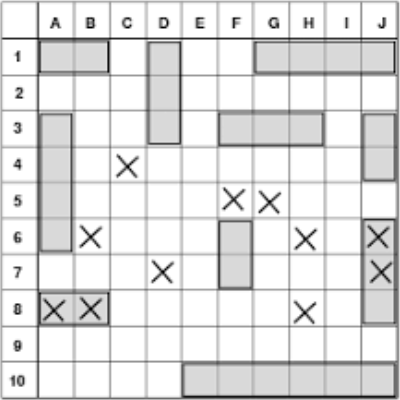

# Assegnazione Progetto

## Battleship

- Il sistema posiziona le navi su una griglia.
- Il giocatore cerca di indovinare la posizione delle navi e affondarle.
- Il giocatore vince se affonda tutte le navi prima di esaurire le mosse.
- Il numero di mosse disponibili dipende dalla modalità di gioco (facile/media/difficile/...).