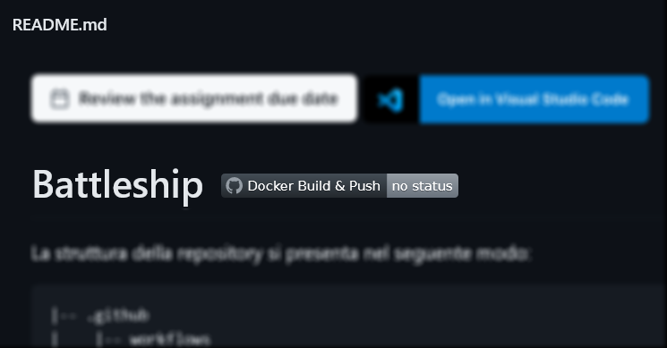

# Guida allo studente

## Indice

- Pipeline di progetto
- Passi preliminari
- Creazione gruppo e repository su GitHub
  - Comunicazione del gruppo
  - Accettazione assignment del primo componente e creazione repository su GitHub
  - Accettazione assignment degli altri componenti e accesso al repository su GitHub
- Configurazione del repository su GitHub
  - Creazione di un Personal Access Token e impostazione del Secret
    - Creazione del Personal Access Token
    - Impostazione del GitHub Secret
  - Abilitazione package/immagini Docker
  - Aggiunta del badge di GitHub Actions nel README
- Clonazione del repository
- Lavoro sul codice dell’applicazione
- Test automatici e Controlli di Qualità
- Esecuzione immagine Docker

## Pipeline di progetto

La creazione e l'aggiornamento degli eseguibili coinvolge una *toolchain* in *pipeline*, ovvero una serie di tool collegati in sequenza in modo che l'output del precedente sia l'input del successivo, come da figura.

Di seguito si riportano le istruzioni dettagliate per attivare la pipeline.

## Passi preliminari

È necessario effettuare l’iscrizione a servizi che saranno utilizzati durante tutto lo sviluppo del progetto. In particolare:

- Adesione al team del corso su Microsoft Teams tramite il codice di accesso pubblicato sul portale di Informatica o mostrato dal docente a lezione.
- Iscrizione a [**github.com**](https://github.com).

In aggiunta, occorre installare i seguenti strumenti:

- [**Teams**](https://www.office.com/) per desktop e mobile;
- [**Git**](https://git-scm.com/downloads);
- [**Docker Desktop**](https://www.docker.com/products/docker-desktop) (può essere posticipato).

Si suppone che lo studente abbia già installato sulla sua macchina l’ultima versione disponibile di un IDE, per esempio [**Visual Studio Code (VS Code)**](https://code.visualstudio.com/).

## Creazione gruppo e repository su GitHub

### Comunicazione del gruppo

- Immettere i propri dati nel form pubblicato su Teams;
- Utlizzare il canale `Formazione gruppi` su Teams per pubblicare annunci di ricerca gruppo o di accoglienza;
- Scrivere il nome del gruppo nello spreadsheet, associato al form, che il docente condividerà su Teams:
  - il nome del gruppo deve essere un cognome di un vincitore di [**ACM Turing Award**](https://amturing.acm.org/byyear.cfm), scritto tutto in minuscolo senza spazi e caratteri speciali. </br>
  Il nome del gruppo sarà usato per la creazione del team e la configurazione del repository su GitHub.
- Una volta completata la formazione del gruppo o raggiunto il numero minimo di componenti, mettersi d'accordo su chi sarà il primo componente del gruppo che accetterà l'*assignment* su GitHub Classroom.
- Il componente designato dal gruppo dovrà scrivere sul canale `Formazione gruppi` di Teams un messaggio rivolto al docente (usare il *mention* con *@*) dichiarando che "il gruppo *x* è pronto" dove *x* è il nome del gruppo.
- Il docente risponderà inviando allo studente in chat il link di assegnazione del progetto.

### Accettazione assignment del primo componente e creazione repository su GitHub

**Le seguenti azioni sono di responsabilità del componente designato dal gruppo**:

- Cliccare sul link di assegnazione del progetto che il docente ha inviato in chat su Teams.
- Scorrere la lista e cliccare sul proprio indirizzo di email
  

- Creare il team scrivendo il nome prescelto e cliccando sul pulsante verde `Create team`.
- Aspettare che GitHub Classroom cloni il repository base per te.
  
- *Fai un refresh della pagina web per verificare il completamento.
  
- Comunicare al docente in chat l'esito della creazione.
- Comunicare agli altri componenti del gruppo il link di assegnazione del progetto precedentemente inviato dal docente.

### Accettazione assignment degli altri componenti e accesso al repository su GitHub

**Le seguenti azioni sono di responsabilità di tutti i componenti tranne quello designato per la creazione del repository**:

- Cliccare sul link di assegnazione del progetto ricevuto dal collega designato.
- Scorrere la lista e cliccare sul proprio indirizzo di email
  
- Unisciti al tuo team cliccando il corrispondente pulsante `Join`
   
   **Se non trovi il team è probabile che l'assignment sia stato accettato prima della creazione del team. Fermarsi e avvisare il componente designato dal.

- Se ti sei unito a un team già creato, dovrai prima confermare la scelta e quindi avrai subito la conferma.
   

- Questo passo terminerà con successo se tutti i componenti del gruppo potranno accedere al repository.

## Configurazione del repository su GitHub

### Creazione di un Personal Access Token e impostazione del Secret

Il repository che vi è stato assegnato contiene tutto il necessario per cominciare lo sviluppo della vostra applicazione. Oltre a una versione base del codice sorgente, esso presenta la struttura di directory alla quale dovrete attenervi durante lo svolgimento del progetto e i file di configurazione per i principali strumenti inclusi nella pipeline.

In particolare, in `.github/workflows`, trovate due file di configurazione di GitHub Actions, denominati `gradle_build.yml` e `docker_build&push.yml`. [Actions](https://github.com/features/actions) è una funzionalità di GitHub che consente la definizione e l'esecuzione automatizzata di pipeline di Continuous Integration / Continuous Deployment (CI/CD). In GitHub Actions, i passaggi di una pipeline vengono specificati in un file `.yml`, detto *workflow*. Generalmente, le pipeline di CI/CD comprendono operazioni di testing, releasing e deployment di un sistema software. Nello specifico,
per il vostro progetto sono state definite due pipeline.

La prima pipeline, definita nel file `gradle_build.yml`, viene innescata da ogni Pull Request e realizza i seguenti passaggi:

1. il testing del vostro codice (unit test con [JUnit](https://junit.org/)) e l'analisi dello stesso con strumenti di quality assurance ([Checkstyle](https://checkstyle.org/), [Spotbugs](https://spotbugs.github.io));
2. la costruzione di un eseguibile (build) a partire dai sorgenti che svilupperete.

La seconda pipeline, definita nel file `docker_build&push.yml`, viene innescata dalle operazioni di push e merge sul branch `main`; oltre a svolgere gli stessi passaggi effettuati dalla prima, effettua la costruzione di un'immagine Docker con la vostra applicazione e il caricamento della stessa su [GitHub Packages](https://github.com/features/packages).

Entrambe le pipeline delegano le operazioni di testing, quality assurance e build a [Gradle](https://gradle.org/) - sistema di build-automation adottato per questo progetto - attraverso l'invocazione del task `gradle build`; in caso di push o merge sul branch `main`, la seconda pipeline si occupa di costruire e caricare su GitHub Packages un'immagine Docker con l'eseguibile appena assemblato.

Affinché vada a buon fine, quest'ultimo passaggio necessita di un piccolo intervento da parte vostra, da svolgere soltanto una volta, nella fase di impostazione iniziale del progetto. Dal momento che ciascuna nuova esecuzione del workflow avviene in una macchina virtuale Ubuntu costruita ex-novo da GitHub Actions, è necessario che - ad ogni run - il processo preposto al caricamento dell'immagine Docker su Packages si autentichi al servizio (effettuando un login). Al posto della classica coppia di credenziali (username e password) è possibile usare, a questo scopo, un Personal Access Token (PAT) di GitHub, da passare in input al comando che effettua la connessione a Packages. Tuttavia, dal momento che tale comando viene riportato in chiaro nel file di workflow (`docker_build&push.yml`), passare in input il token in modo esplicito significherebbe memorizzarne una copia che resti visibile a chiunque abbia accesso al repository; ciò non è affatto sicuro e andrebbe assolutamente evitato perché un token è strettamente personale. Per questo genere di esigenze, GitHub offre ai suoi utenti un'ulteriore funzionalità, i cosiddetti Secrets, valori crittografati associati ai repository e accessibili come variabili d'ambiente all'interno dei workflow. Una volta generato, il PAT può essere memorizzato in tutta sicurezza in un Secret. Al momento opportuno, il valore ivi contenuto verrà passato al comando di accesso a Packages che ne ha bisogno.

L'intervento iniziale a voi richiesto deve essere svolto da *un solo membro del team* che dovrà:

- [dalle impostazioni del proprio account] creare un Personal Access Token;
- [dalle impostazioni del repository del team] generare un GitHub Secret contenente il token e un ulteriore Secret contenente il proprio GitHub username.

#### Creazione del Personal Access Token

Il membro del team, avendo i diritti di amministratore sul repository, deve:

- entrare nella pagina delle impostazioni del proprio profilo GitHub (click sull'immagine di profilo in alto a destra, poi click sulla voce *"Settings"* nel menù a tendina che compare);
  

- entrare nella sezione delle impostazioni per sviluppatori, *"Developer Settings"*, facendo click sul relativo pulsante nella barra laterale;
  

- selezionare *"Personal Access Token"* nella barra laterale e successivamente fare click su *"Generate new Token"*, in alto a destra;
  

- indicare nel campo *"Note"* l'utilizzo che si intende fare del token (ad es.: *"Uploads of Docker images to GitHub Packages"*). Tale appunto tornerà utile in futuro per ricordarsi a quale scopo era stato generato il token;

- selezionare gli ambiti di validità del token (*"Scopes"*). Per consentire al processo Docker di caricare un'immagine su GitHub Packages, il set minimale di scope da abilitare è il seguente (vedi figura):

  - `repo` (con tutte le relative sotto-voci)
  - `write:packages`
  - `read:packages`

  

- fare click sul pulsante *"Generate token"*, in basso nella pagina;
- copiare il token che apparirà alla pagina seguente e memorizzarlo in un luogo sicuro.
  **N.B.**: non sarà più possibile visionare il token una volta usciti dalla pagina!

#### Impostazione dei GitHub Secret

A questo punto, il membro del team che ha generato il token dovrà:

- recarsi sulla pagina principale del repository e fare click sull'icona *"Settings"* (ultima tab in alto a destra);
  **N.B.**: solo l'amministratore visualizza questa tab!
  
- selezionare la voce *"Secrets"* e la sottovoce *"Actions"* dalla barra laterale;
  
- fare click sul pulsante *"New repository secret"*:
 
  - inserire la stringa `GH_ACCESS_TOKEN` nella textbox con l'etichetta *"Name"*;
  - inserire il Personal Access Token precedentemente generato nella textarea con l'etichetta *"Value"*;
  - concludere l'operazione cliccando sul pulsante *"Add secret"*.
- ripetere l'operazione per l'aggiunta di un secret col proprio username: fare click sul link *"New repository secret"*;
  - inserire la stringa `GH_USERNAME` nella textbox con l'etichetta *"Name"*;
  - inserire il proprio username GitHub nella textarea con l'etichetta *"Value"*;
  - concludere l'operazione cliccando sul pulsante *"Add secret"*.

**N.B.:** È fondamentale che i nomi dei due GitHub Secret vengano scritti esattamente come sono riportati in questa guida: `GH_ACCESS_TOKEN` e `GH_USERNAME`(rispettando le maiuscole e gli underscore).

## Abilitazione package/immagini Docker

Affinché tutti i membri del team possano visualizzare e scaricare l'immagine Docker del proprio progetto da GitHub Packages, è necessario che colui che ha inserito il proprio Personal Access Token tra i secret del repository svolga i seguenti passaggi:

1. accedere al proprio repository su GitHub;
2. cliccare sul link del package associato al repository; il link è collocato nella barra laterale destra della pagina principale del repository, sotto l'intestazione "Packages"
(vedi freccia rossa in figura); 
N.B.: il package sarà visibile solo dopo che GitHub Actions avrà completato con successo la prima build del progetto;
3. cliccare sul link "Package settings", presente nella pagina dedicata al package come ultima voce nella barra laterale destra (vedi freccia rossa in figura); 
4. scorrere in basso, sino all'intestazione "Manage access"; aggiungere il proprio team alla lista dei membri, conferendo allo stesso i permessi di "Admin" (vedi freccia rossa in figura); .

## Aggiunta del badge di GitHub Actions nel README

Per aggiungere il badge che riporta l'ultimo esito dell'esecuzione del workflow `docker_build&push.yml` (stato del workflow) all'interno del file README del vostro repository, seguire le seguenti istruzioni:

- entrare nella pagina principale del repository e cliccare su `Actions` (subito sotto il titolo, in alto al centro);

- la pagina *"All workflows"* sotto la tab *"Actions"*, riporta l'elenco delle esecuzioni (*run*) di tutti i workflow di GitHub Actions attivabili nel repository; per filtrarne il contenuto e visualizzare soltanto le esecuzioni relative al workflow `docker_build&push.yml`, fare click sulla voce corrispondente nel pannello laterale a sinistra. (**N.B.**: all'inizio del progetto, è del tutto normale che queste liste siano vuote. I workflow si attiveranno per la prima volta quando modificherete il codice nella cartella `src/` ed effettuerete Pull Request o operazioni di push/merge sul branch `main`);
- Una volta selezionato il workflow `docker_build&push.yml` dal pannello laterale, in alto a destra nella pagina – di fianco alla text box con la scritta "Filter workflow runs" – comparirà un nuovo bottone con tre puntini `•••`. Fare click su tale bottone e poi selezionare la voce "Create status badge" nel menù a tendina.
- Lasciando invariate le impostazioni di default (`branch` e `event`) nella finestra a comparsa, fare click su `Copy status badge Markdown`;
  
- La modifica del file Markdown `README.md` sarà fatta come parte dei task dello *Sprint 0* incollando il codice markdown per la costruzione del badge in cima al `README.md`, accanto al titolo del repository.

Il titolo del README.md dovrà apparire come nella seguente figura, con *Battleship* al posto di *scacchi*:



Il colore e lo stato del badge potranno cambiare dopo ogni build, riflettendo lo stato del progetto.


## Clonazione del repository

Come prima attività, è necessario clonare il repository remoto sulla propria macchina. Procedere come segue:

- Individuare la posizione nel proprio file system dove clonare la cartella di progetto.
<!--*Per evitare successivi problemi con l'importazione di Eclipse, evitare di salvare la cartella di progetto nella root del workspace di Eclipse*;
-->
- Da terminale con shell bash spostarsi attraverso il comando *cd* nella cartella scelta al passo precedente;
- Scrivere il comando `git clone <url>` , dove l’url è quello visibile da GitHub premendo il bottone *Clone or Download*, in alto a destra nell’interfaccia. Ad esempio:


Se l’operazione è andata a buon fine, sarà possibile importare il progetto nell'IDE con cui intendete lavorare.

<!--
**Configurazione di Eclipse**

Assicuarsi di aver installato [Java versione 8](https://www.oracle.com/technetwork/java/javase/overview/index.html) ed [Eclipse IDE for Java](https://www.eclipse.org/downloads/) versione 2019-12 (4.14.0) o superiore.

**Importazione del progetto in Eclipse**

Per importare correttamente il progetto in Eclipse, si dovrà seguire solo un semplice accorgimento: anziché creare un progetto Java (scelta di default), si opterà per la creazione di un progetto Gradle. Più nel dettaglio:

- Da *File* selezionare la voce *Import* per importare il progetto;
- Selezionare sotto la cartella *Gradle*, la voce *Existing Gradle Project*


- Dopo aver superato l’eventuale *Welcome*, bisognerà specificare come *Project root directory* la cartella di progetto clonata al passo precedente;
- A questo punto terminare l’operazione con *Finish*.

**Modifica della cartella di default per javadoc**

La cartella di default per la generazione di *javadoc* è la cartella `doc`. Per conformità con la struttura della repository di base del progetto, dovremo modificare il percorso e puntare a `nomeprogetto/docs/javadoc`:

- Premere il tasto destro sulla cartella di progetto di Eclipse. Scegliere quindi l’opzione *Properties*, in coda al menù contestuale.
  
- Individuare, tra le proprietà, quella denominata *Javadoc Location*.

- Tramite il pulsante *Browse*, selezionare il percorso `docs/javadoc` all’interno della cartella di progetto.
- Chiudere la finestra con *Apply and Close*.
-->

## Lavoro sul codice dell’applicazione

Il workflow da utilizzare è il [GitHub Flow](https://guides.github.com/introduction/flow/) e prevede essenzialmente i seguenti passi:

- Subito prima di lavorare sul codice, è opportuno eseguire una `git fetch` e, se `git status` informa che ci sono modifiche, eseguire quindi una `git pull` per poi lavorare sul codice più aggiornato
- Per ogni nuova *feature*, *user story* o *bug fix* occorre creare o scegliere l’issue su cui lavorare su GitHub e segnarsi come **assigned**
- Creare un nuovo **branch** sul repository locale con il numero dell'issue o il titolo come nome del branch (*issue#n* oppure *titoloissue*) attraverso il comando `git branch <nome branch>`
- Spostarsi sul nuovo branch appena creato con il comando `git checkout <nome branch>`
- Lavorare al codice dell’applicazione. È consigliabile fare piccole **commit** autoconsistenti di volta in volta, con uno scopo ben preciso e una descrizione dettagliata. *Evitare di fare un’unica grande commit alla fine del lavoro, a meno che la feature o il bug fix non sia davvero di poco conto.*
- Aggiorna con regolarità il branch sul server origin in GitHub con il comando `git push origin <nome branch>`
- Quando la modifica è stata correttamente implementata, si consiglia di scrivere adeguati test di unità per validarne la correttezza.
- Dopo l’esecuzione dei test è possibile lanciare gli strumenti di **Quality Assurance** (checkstyle e findbugs) per assicurarsi di aver scritto codice di qualità. Leggere la sezione *Controlli di Qualità* per ulteriori informazioni.
- A questo punto, dunque, si può procedere all'apertura di una pull request, andando su GitHub e posizionandosi sul branch su cui si sta lavorando.
- Scrivere un titolo conciso ed esplicativo per la pull request e una descrizione significativa per il revisore come commento, incluso un riferimento all'issue nella forma *closes #n*. Scegliere almeno un reviewer tra i componenti del team.
- Una volta lanciata la pull request, nel caso si attivi la costruzione automatica della build ci sarà da attendere qualche minuto. In caso di conflitti, bisogna risolverli. Può essere utile consultare la documentazione di GitHub (<https://help.github.com/articles/about-merge-conflicts/>) e comunicare con chi ha effettuato le modifiche in conflitto.
- Discutere eventuali commenti dei reviewer e apportare le modifiche se necessarie come commit sul branch di lavoro. Ricordare che i commit aggiuntivi vanno comunque propagati sul repository remoto in GitHub mediante comando `git push origin <nome branch>`.
- Ricevuta l'approvazione esplicita di almeno un componente del team, si può procedere da GitHub al merge del nuovo *branch* con il *master branch* sul repository remoto.
- Se la build GitHub Actions e il merge su GitHub sono entrambi andati a buon fine, per completare il lavoro, cancellare il branch sul repository remoto (mediante interfaccia web di GitHub) e sul repository locale con la sequenza di comandi: `git checkout master`, `git pull` e `git branch -d <nome branch>`.

## Test automatici e Controlli di Qualità

È possibile effettuare test automatici e operare dei controlli statici sulla qualità del codice Java (QA, quality assurance), grazie a strumenti come *JUnit*, *Checkstyle* e *Spotbugs*. Per lanciarli in un colpo solo si può utilizzare *Gradle*.
<!--
- Assicurarsi che sia aperta la vista *Gradle Tasks* in Eclipse. In caso negativo, dal menù *Window*, selezionare *Show View* e poi *Other*. La vista si troverà sotto la voce *Gradle*. Nell’eventualità che la vista non compaia, provare a cambiare *perspective* su Eclipse e selezionare *Java EE*: ciò si può fare o premendo Java EE dal bottone in alto a destra o da menù *Window-\>Perspective-\>Open Perspective-\>Other* e poi *Java EE*.
- Selezionare il nome del progetto e, tra le diverse opzioni, *verification*.
- Avviare il controllo attraverso l’operazione di **check**, che eseguirà automaticamente sia la build del progetto, sia i test di unità, sia i controlli di qualità.
- Aggiungere al controllo di versione la cartella `build/reports/` (**non** tutta la cartella `build/`), contenente i report degli strumenti.


- Per verificare gli errori, eventualmente individuati dagli strumenti di QA, si deve aprire la vista *Console*.
-->

**N.B.** Nella configurazione attuale del progetto la presenza di errori non impedisce la corretta compilazione del codice. Si suggerisce, tuttavia, di limitare il più possibile *warnings* ed *errori* segnalati da questi strumenti.

## Esecuzione immagine Docker

Dopo ogni operazione di push o pull request sul repository, GitHub Actions tenta di compilare l’applicazione e, in caso di successo, esegue test e controlli di quality assurance. Nel caso in cui la compilazione e i test siano andati a buon fine, GitHub Actions  ha il compito di caricare l’immagine del container su GitHub Packages. Per essere certi che il codice non presenti problemi, occorre scaricare l’immagine da GitHub Packages ed eseguire il container mediante l’installazione locale di Docker.

Svolgere le seguenti operazioni:

- avviare Docker Desktop localmente;

- effettuare l'autenticazione di Docker a GitHub Packages:
  - se non l'avete già fatto, create un vostro *personal access token* di GitHub seguendo le istruzioni riportate in questa guida nella sezione ["Creazione del Personal Access Token"](#creazione-del-personal-access-token);
  - salvate il vostro token in un file di testo (ad esempio, potete salvarlo in un file chiamato `TOKEN.txt`);
  - portatevi nella cartella in cui avete salvato il token ed eseguite il comando:

    ```bash
    cat ./TOKEN.txt | docker login ghcr.io -u <USERNAME> --password-stdin
    ```

    sostituendo il vostro username di GitHub alla voce `<USERNAME>`.

    **N.B.**: è necessario effettuare questo passaggio soltanto al primo utilizzo di Docker con GitHub Packages;

<!--- se si utilizza Windows selezionare `Switch to Linux containers` nel menu di Docker;
-->

- recarsi alla pagina principale dedicata al repository su GitHub e fare click sul link del package sotto il titolo *"Packages"*, come evidenziato in figura;
   **N.B.**: se i Secret menzionati in questa guida sono stati impostati correttamente e se almeno un'esecuzione del workflow di GitHub Actions è andata a buon fine, la vostra immagine Docker (nella sua ultima versione) dovrebbe essere disponibile.
   

- nella pagina dedicata al package è indicato il comando da copiare ed eseguire nel terminale per scaricare l'immagine Docker in locale.
   

- incollare ed eseguire il comando nel terminale. Attendere che Docker scarichi l’immagine dell’applicazione

- digitare infine il comando:

  ```shell
    docker run --rm -it <nome_immagine>
  ```

  dove per `<nome_immagine>` si intende l'url riportato nel comando precedente, immediatamente dopo le prime due parole (`docker pull`).

Ad esempio, se il comando precedente (copiato da GitHub dal riquadro mostrato in figura), è:

```shell
docker pull docker.pkg.github.com/softeng2122-inf-uniba/provaprogetto2122-prova/prova:latest
```

il comando per eseguire il container sarà:

```shell
docker run --rm -it docker.pkg.github.com/softeng2122-inf-uniba/provaprogetto2122-prova/prova:latest
```

(in altre parole, il secondo comando si ottiene dal primo sostituendo a `docker pull` le parole `docker run --rm -it`).

**Osservazione:** l’opzione `—-rm` serve per far sì che Docker interrompa l’esecuzione del container nel momento in cui l’applicazione eseguita al suo interno termina; le opzioni `-i` e `-t`, impostate con l'abbreviazione `-it`, hanno le seguenti funzioni:

- `-i` (abbreviazione di `--interactive`) serve a richiedere un’esecuzione interattiva del container;
- `-t` (abbreviazione di `--tty`) serve invece ad allocare uno *pseudo-tty* (una sorta di terminale virtuale) connesso allo standard input (genericamente, la tastiera del computer).

In sostanza state chiedendo a Docker di eseguire interattivamente il container e state specificando la sorgente di input per la sessione interattiva.

**N.B.**: in caso di necessità, avete la possibilità di passare parametri alla vostra applicazione aggiungendo stringhe in coda al comando `run`. Per esempio:

```shell
docker run --rm -it <nome_immagine> help
```
