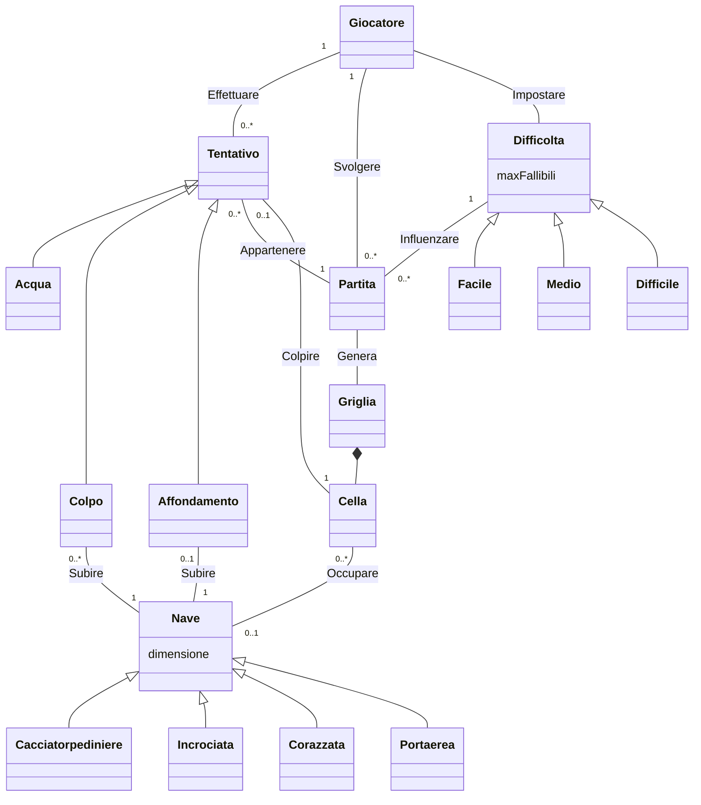

# Report

## (1) Introduzione

## (2) Modello di Dominio

## (3) Requisiti Specifici
### (3.1) Requisiti funzionali
### (3.2) Requisiti non funzionali

## (7) Manuale Utente

## (9) Analisi Retrospettiva
### (9.1) Sprint 0

