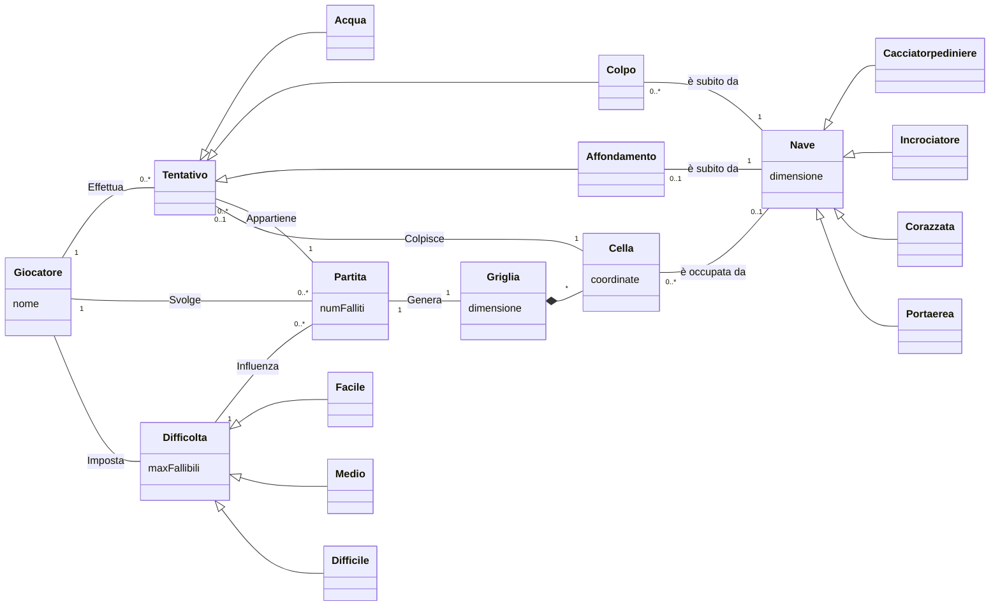

# Report

## (1) Introduzione

## (2) Modello di Dominio

### diagramma

### Glossario degli attributi
|Attributo|Concetto di appartenenza|Descrizione|
|-|-|-|
| coordinate | Cella | coppia che individua univocamente una Cella di una Griglia. |
| dimensione | Griglia | Numero di righe e di celle per riga. Per esempio, `dimensione=10` implica $10^2$ celle. |
| dimensione | Nave | Numero di celle che la nave occupa. |
| maxFallibili | Difficoltà | Numero massimo di tentativi fallibili. |
| nome | Giocatore | Nome del giocatore |
| numFalliti | Partita| Numero corrente di tentativi falliti; Si ottiene contando il numero di istanze di Acqua relative alla Partita. |

### Note
- (Definizione) Tra *Griglia* e *Cella* vi è una **composizione**:
    - Una *Griglia* è composta da più *Celle* (vedi molteplicità `*` nel diagramma)
    - **dipendenza esistenziale**: Una *Cella* esiste solo se parte di una *Griglia*
    - **esclusività**: Una *Cella* può appartenere ad una e una sola *Griglia*
- (Notazione) Si dice fallito un *Tentativo* di tipo *Acqua*.

## (3) Requisiti Specifici
### (3.1) Requisiti funzionali
- (RF1) Il sistema deve permettere di creare una nuova partita.
### (3.2) Requisiti non funzionali

## (7) Manuale Utente

## (9) Analisi Retrospettiva
### (9.1) Sprint 0

