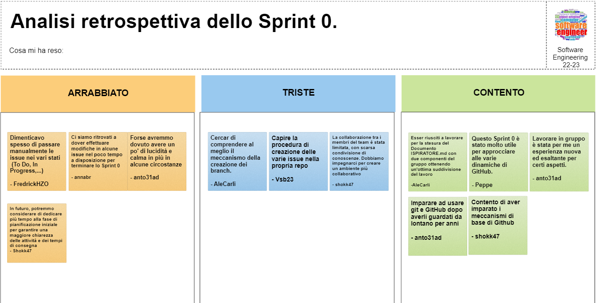

# Report

## (1) Introduzione
_Benvenuti_ nel progetto di *Battaglia Navale!* La nostra **BattleShip** offre un'esperienza di gioco solitario contro un avversario virtuale, il computer. Potete scegliere tra diverse modalità di gioco, inclusi i livelli di difficoltà: `facile`, `medio` e `difficile`. Ogni modalità prevede un numero massimo di tentativi, rispettivamente 50, 30 e 10.

Il gioco si svolge su due mappe di dimensione `10x10`: una mappa dedicata ai colpi e un'altra alle navi. Le celle sono identificate da coordinate che combinano **lettere** per le colonne e **numeri** per le righe. Ad esempio, la cella `F-3` si riferisce alla colonna F e alla riga 3.

Le navi vengono posizionate automaticamente utilizzando un algoritmo, rimanendo nascoste al giocatore. È possibile che due o più navi si tocchino, ma non possono sovrapporsi. Le navi occupano un numero specifico di celle in posizione verticale o orizzontale, senza diagonali.

Ci sono quattro tipi di navi con diverse dimensioni: `Cacciatorpediniere`, `Incrociatore`, `Corazzata` e `Portaerei`. Il vostro obiettivo è distruggere le navi nemiche seguendo queste quantità: `4` cacciatorpediniere, `3` incrociatori, `2` corazzate e `1` portaerei.

**Dopo aver posizionato le navi, il gioco inizia**. Ogni turno, il giocatore sceglie una cella da colpire, come ad esempio `A-8` per la prima colonna e l'ottava riga. All'inizio, la mappa dei colpi mostra un simbolo che indica che _nessuna cella è stata ancora colpita_.

Dopo ogni colpo, la mappa dei colpi viene aggiornata in base all'esito dell'attacco. Una `X` viene visualizzata se viene colpito un pezzo di nave, mentre il simbolo `~` indica l'acqua, ovvero una cella senza nave.

La _partita termina_ quando *tutte* le navi nemiche sono state affondate o quando si esauriscono i tentativi consentiti dal livello di difficoltà.

_Durante la partita, è possibile abbandonare il gioco in qualsiasi momento_. Inoltre, è possibile richiedere di rivelare la griglia del computer con le navi posizionate per avere una visione strategica della disposizione delle navi nemiche.

**Siete pronti per la sfida? Immergetevi in questa battaglia navale epica e dimostrate la vostra abilità strategica per conquistare il mare!**
## (2) Modello di Dominio

### diagramma

### Glossario degli attributi
|Attributo|Concetto di appartenenza|Descrizione|
|-|-|-|
| coordinate | Cella | coppia che individua univocamente una Cella di una Griglia. |
| dimensione | Griglia | Numero di righe e di celle per riga. Per esempio, `dimensione=10` implica $10^2$ celle. |
| dimensione | Nave | Numero di celle che la nave occupa. |
| maxFallibili | Difficoltà | Numero massimo di tentativi fallibili. |
| nome | Giocatore | Nome del giocatore |
| numFalliti | Partita| Numero corrente di tentativi falliti; Si ottiene contando il numero di istanze di Acqua relative alla Partita. |

### Note
- (Definizione) Tra *Griglia* e *Cella* vi è una **composizione**:
    - Una *Griglia* è composta da più *Celle* (vedi molteplicità `*` nel diagramma)
    - **dipendenza esistenziale**: Una *Cella* esiste solo se parte di una *Griglia*
    - **esclusività**: Una *Cella* può appartenere ad una e una sola *Griglia*
- (Notazione) Si dice fallito un *Tentativo* di tipo *Acqua*.


## (3) Requisiti Specifici
### (3.1) Requisiti funzionali
- (RF1) Il sistema deve permettere di creare una nuova partita.
- (RF2) Il sistema deve permettere di chiudere l'applicazione.
- (RF3) Il sistema deve permettere di impostare la difficoltà di gioco tra _FACILE_, _MEDIO_ e _DIFFICILE_. 
- (RF4) Il sistema, in base alla difficoltà impostata deve impostare il numero massimo di tentativi fallibili.
- (RF5) Il sistema imposta i tentativi fallibili nel seguente modo:
  - (RF5.1) Se la difficoltà è _FACILE_ il numero di default massimo di tentativi fallibili è 50.
  - (RF5.2) Se la difficoltà è _MEDIO_ il numero di default massimo di tentativi fallibili è 30.
  - (RF5.3) Se la difficoltà è _DIFFICILE_ il numero di default massimo di tentativi fallibili è 10.
- (RF6) Il sistema deve permettere di mostrare il livello di difficoltà impostato.
- (RF7) Il sistema deve permettere di svelare le posizioni delle navi nella griglia della partita in corso
- (RFx1) Il ssitema deve permettere di visualizzare una griglia con le righe numerate a partire da 1 e le colonne numerate a partire da A, con le navi affondate e le sole parti giàcolpite delle navi non affondate.
- (RFx2) Il sistema deve peremttere di impostare il numero massimo di tentativi falliti per livello di gioco. In particolare:
   - (RFx2.1) Al comando `/facile numero` l'applicazione risponde con "OK" e imposta a numero il numero massimo di tentativi falliti.
   - (RFx2.2) Al comando `/medio numero` l'applicazione risponde con "OK" e imposta a numero il numero massimo di tentativi falliti.
   - (RFx2.3) Al comando `/difficile numero` l'applicazione risponde con "OK" e imposta a numero il numero massimo di tentativi falliti. 
- (RFx3) Il sistema deve permettere di impostare direttamente il numero massimo di tentativi che si possono fallire. In particolare:
   - (RFx3.1) Al comando `/tentativi numero` l'appliczione risponde con OK e imposta a numero il numero massimo di tentativi falliti.
- (RFx4) Il ssitema deve permettere di impostare la taglia della griglia. In particolare:
   - (RFx4.1) Al comando `/standard` l'applicazione risponde con "OK" e imposta 10x10 la dimensione della griglia. Nel caso in cui il giocatore decide di avviare l'applicazione senza impostre la griglia, per default verrà scelto il caso standard.
   - (RFx4.2) Al comando `/large` l'applicazione risponde con "OK" e imposta a 18x18 la dimensione della griglia.
   - (RFx4.3) Al comando `/extralarge` l'applicazione risponde con "OK" e imposta a 26x25 la dimensione della griglia.
- (RFx5) Il sistema deve permettere di impostare il tempo di gioco. In particolare:
   - (RFx5.1) Al comando `/tempo numero` l'applicazione rsiponde con "OK" e imposta a numero il numero di minuti a disposizione per giocare.
- (RFx6) Il sistema al comando `/mostratempo` deve permettere di mostrare il numero di minuti trascorsi nel gioco e il numero di minuti ancora disponibili.
- (RFx7) Il sistema deve permettere di effettuare un tentativi per colpire una nave.
   - (RFx7.1) Digitando una coppia id caratteri separati da un trattino, corrispondenti rispettivamente al numero di riga e alla lettera della colonna (es: B-4), l'applicazione risponde con "acqua" se sulla cella non è posiziona nessuna nave, risponde con "colpito" se sulla cella è posizionata una nave e risponde "colpito e affondato" se sulla cella è posiziona una nave ed è l'ultima cella non colpita della nave.
   - (RFx7.2) Qualunque sia l'esito del tentativo, l'applicazione deve mostrare la griglia con le navi colpite partizlamente o affondata, il numero di tentativi già effettuati e il tempo trascorso.
   - (RFx7.3) La partita termina con successo se il tentativo ha affondato l'ultima nave.
   - (RFx7.4) La parita termina con insuccesso se è stato raggiunto il numero massimo di tentativi falliti o se è scaduto il tempo di gioco.
- (RFx8) Il sistema deve permettere di mostare la griglia con le navi colpite e affondate.
   - (RFx8.1) Al comando `/mostragriglia` l'applicazione risponde visualizzando, una griglia con le righe numerate a partire da 1 e le colonen numerate a partire da A, con le navi affondate e le sole parti già colpite delle navi non affondate.
- (RFx9) Il sistema deve permetter di mostrare il numero di tentativi già effettuati e il numero di tentativi falliti.
   - (RFx9.1) Al comando `/mostratentativi` l'applicazione risponde visualizzando il numero di tentativi già effettuati, il numero di tentativi falliti e il numero massimo di tentativi falliti.
- (RFx10) Il sistema deve permettere al giocatore di abbandonare una partita in corso.
- (RF8) Il sistema deve permettere di mostrare i tipi di navi presenti nel gioco, specificandone il numero di esemplari possibili.
- (RF9) Il sistema deve permettere di elencare i comandi leciti per interagire con esso. I comandi del gioco sono:
  - (RF9.1) `/help`: mostra l'elenco dei comandi leciti. Il sistema deve mostrare l'elenco dei comandi leciti.
  - (RF9.2) `/gioca`: avvia una nuova partita.
  - (RF9.3) `/esci`: chiude l'applicazione.
  - (RF9.4) `/facile`: imposta la difficoltà di gioco a _FACILE_.
  - (RF9.5) `/medio`: imposta la difficoltà di gioco a _MEDIO_.
  - (RF9.6) `/difficile`: imposta la difficoltà di gioco a _DIFFICILE_.
  - (RF9.7) `/mostranavi`: visualizza per ogni tipo di nave il nome, la dimensione in quadratini e il numero di esemplari da affondare.
  - (RF9.8) `/mostralivello`: visualizza il livello di difficoltà impostato e il numero massimo di tentativi fallibili.
  - (RF9.9) `/svelagriglia`: svela la posizione delle navi nella griglia della partita in corso.
### (3.2) Requisiti non funzionali
- (RNF1) Il container docker dell'app deve essere eseguito da terminali che supportano Unicode con encoding UTF-8 e UTF-16.
  - (RNF1.1) Per linux e macos si consiglia di utilizzare il terminale di default.
  - (RNF1.2) Per Windows si consiglia di utilizzare Powershell o il terminale di git bash.
- (RNF2) Per eseguire il container docker dell'app è necessario:
  - (RNF2.1) Avere installato docker sul proprio sistema operativo.
  - (RNF2.2) Eseguire il comando `docker pull ghcr.io/softeng2223-inf-uniba/battleship-thacker:latest`.
  - (RNF2.3) Eseguire il container docker con il comando `docker run --rm -it ghcr.io/softeng2223-inf-uniba/battleship-thacker:latest`.
- (RNF3) Il sistema deve essere sviluppato in Java utilizzando la JDK 19.

## (7) Manuale Utente

### **(7.1) Prerequisiti**
Al fine di garantire una corretta esecuzione del programma su qualsiasi macchina, evitando dunque imcompatibilità varie, è necessaria l'installazione preventiva della piattaforma Docker.

#### **(7.1.1) Installazione Docker**

La prima cosa da fare è scaricare il contenuto di uno dei link riportati di seguito, a seconda della versione del sistema operativo che si sta usando : 

<span style="text-align:center">

[Linux](https://docs.docker.com/desktop/linux/install/)

[Apple](https://desktop.docker.com/mac/main/amd64/Docker.dmg?utm_source=docker&utm_medium=webreferral&utm_campaign=dd-smartbutton&utm_location=module)

[Windows](https://desktop.docker.com/win/main/amd64/Docker%20Desktop%20Installer.exe?utm_source=docker&utm_medium=webreferral&utm_campaign=dd-smartbutton&utm_location=module)

</span>

Dopodiché, bisognerà eseguire il file appena scaricato (.exe per Windows, .dmg per Apple) e installare 
Docker.

#### **(7.1.2) Installazione WSL (Windows)**

Se si sta cercando di eseguire il programma su una macchina con MacOS o Linux, si può saltare questo passaggio.

Se,invece, si sta utilizzando Windows, Docker non funzionerà se prima non verrà installato il Windows Subsystem Linux. Sarà necessario solamente scrivere la seguente riga all'interno di un qualsiasi terminale: 

```sh
wsl --install + LINUX
```
Dove al posto di LINUX andrà la distribuzione di vostro gradimento. 

Per visualizzare un elenco delle distro Linux supportate nella WSL basterà digitare sempre da terminale: 
```sh
wsl --list --online 
```
#### **(7.1.3) Esecuzione immagine Docker** 

Una volta installato Docker (e il WSL, per gli utenti Windows) andrà eseguita l'immagine creata da Docker.  

Per fare questo, basterà eseguire i passaggi di sotto indicati in maniera sequenziale: 

- Avviare il programma Docker 
- Autenticare Docker per Github Packages  
  - creare un file di testo con al suo interno il _personal access token_ di Github ([Istruzioni per la loro creazione](https://docs.github.com/en/authentication/keeping-your-account-and-data-secure/creating-a-personal-access-token))
  - digitare il seguente comando  
    ```sh 
    cat ./TOKEN.txt | docker login ghcr.io -u <USERNAME> --password-stdin 
    ```
    Sostituendo `./TOKEN.txt` con il percorso dove è stato salvato il file di testo e `<USERNAME>` con il proprio username di Github.
- Copiare il package di Docker della repo di riferimento:
  
  - Recarsi nella sezione  principale della repo e cliccare sul nome dell'immagine Docker, sotto la sezione **Packages**
  - Copiare il comando tramite l'apposito pulsante ed incollarlo nel terminale 
  - Eseguire il comando per scaricare l'immagine 
- Digitare il comando 
  ```sh 
  docker run --rm -it <nome_immagine>
  ```
  Sostituendo ``<nome_immagine>`` con il nome dell'immagine Docker di riferimento. 

Una effettuati questi passaggi, il programma sarà **pronto** per essere eseguito. 

#### (7.2) Incominciare il gioco

Eseguita l'immagine Docker, il giocatore si troverà davanti una schermata in cui potrà digitare **due comandi**. 

#### (7.2.1) Elenco dei comandi 

```sh
/help o --help o -h
```

  Con il seguente comando verranno mostrati a schermo tutti i comandi utilizzabili di cui segue una breve descrizione di ognuno: 


  - ``/gioca`` permette di iniziare una nuova partita;
  - ``/facile`` imposta il livello di difficoltà su facile, quindi si avranno a disposizione massimo 50 tentativi a vuoto   
  - ``/medio`` imposta il livello di difficoltà su medio, quindi si avranno a disposizione massimo 30 tentativi a vuoto   
  - ``/difficile`` imposta il livello di difficoltà su difficile, quindi si avranno a disposizione massimo 10 tentativi a vuoto   
  - ``/mostralivello`` permette di mostrare, durante una partita, il livello di difficoltà 
  - ``/svelagriglia`` permette di mostrare la griglia dell'avversario 
  - ``/mostranavi`` mostra il nome delle navi, la loro rappresentazione nel gioco e la loro rispettiva quantità disponibile, come riportato nella seguente tabella: 

      |Nome|Numero esemplari|
      |-|-|
      | Cacciatorpediniere   | 4 |
      | Incrociatore  | 3 |
      | Corazzata  | 2 |
      | Portaerei  | 1 |   

  - ``/esci`` permette di terminare l'esecuzione del programma, dietro previa conferma


#### (7.2.2) Inizio di una partita

```
/gioca
```
Con questo comando sarà possibile iniziare una nuova partita. Una volta eseguito questo comando, verranno disposte, in maniera casuale, tutte le navi.

#### (7.2.3) Posizionare le navi

Le navi verranno posizionate in maniera **automatica** in una griglia di dimensione 10x10, senza il bisogno dell'intervento del giocatore. 

Le righe della griglia saranno numerate da 1 a 10, mentre le sue colonne saranno contrassegnate dalle lettere dalla A alla J. 


#### (7.2.4) Sistema dei colpi

Se il colpo lanciato dall'utente colpisce una casella **vuota**, sulla griglia verrà mostrato il simbolo **"~"**. Se, invece, colpisce una nave, verrà mostrata una **"X"** nella casella colpita. 

Quando non rimane più nessuna cella, della nave colpita,intatta,essa potrà essere dichiarata **affondata**. 

### (7.2) Scopo del gioco

L'obiettivo del giocatore è quello di affondare le navi nemiche prima di esaurire tutti i tentativi dettati dalla difficoltà impostata in fase di preparazione  della partita. 

## (9) Analisi Retrospettiva
All'interno di questa sezione si trovano le relazioni dei vari Sprint che verranno eseguiti durante lo sviluppo del progetto.
### (9.1) Sprint 0

Relazione del meeting del gruppo Thacker riguardo ciò che è accaduto durante lo Sprint 0.
Meeting avvenuto il giorno 14/04/2023
**Partecipanti al meeting:**
- Federico Armagno
- Annarita Bruno
- Vito Stefano Birardi
- Alessandro Carli
- Giovanni Cirigliano
- Antonio Dambra
- Giuseppe D'Urso
  
**Relazione:**
Con lo Sprint 0 il gruppo Thacker ha avuto il primo approccio con le varie dinamiche della piattaforma GitHub ottenendo diversi riscontri.

In questo meeting abbiamo affrontato diversi punti chiave riguardanti la pianificazione, la gestione delle emozioni, le modifiche dell'ultimo minuto e le esperienze individuali all'interno del gruppo. Di seguito, riassumo i principali argomenti discussi.

- Giovanni Cirigliano ha sostenuto la necessità di dedicare più tempo alla fase di pianificazione nei prossimi sprint. Ha evidenziato che una pianificazione approfondita è fondamentale per garantire una maggiore chiarezza sulle attività e sui tempi di consegna. La sua proposta è stata accolta positivamente dal resto del team, che ha riconosciuto l'importanza di una pianificazione solida per il successo del progetto.

- Antonio Dambra ha espresso la sua insoddisfazione riguardo alla gestione delle emozioni in alcune circostanze. Ha evidenziato la necessità di mantenere la calma anche durante situazioni stressanti o conflittuali. Il team ha riconosciuto l'importanza di gestire le emozioni in modo efficace.

- Annarita Bruno ha condiviso la sua insoddisfazione riguardo al fatto che, a causa del poco tempo a disposizione, si è dovuto affrontare un numero elevato di modifiche dell'ultimo minuto. Ha evidenziato come ciò abbia comportato un carico di lavoro aggiuntivo e rallentato il progresso generale del progetto. Il team ha riconosciuto l'importanza di una pianificazione accurata per ridurre le modifiche dell'ultimo minuto e ha discusso di strategie per migliorare la gestione del tempo e delle attività.

- Antonio Dambra si è mostrato entusiasta di lavorare in gruppo, definendolo un'esperienza potenzialmente esaltante. Ha sottolineato l'importanza di creare un ambiente di lavoro positivo e collaborativo, in cui i membri del team si sentano motivati e valorizzati.

- Federico Armagno ha ammesso che spesso,nei primi giorni di lavoro,ha avuto delle sviste per quanto riguarda lo spostare le issue nei vari stati (To Do, In progress, ecc...). Il team ha riconosciuto l'importanza di mantenere traccia dello stato delle attività per una migliore fluidità ed organizzazione del lavoro.

- Giuseppe D'Urso ha sostenuto che lo sprint 0 è stata un'esperienza utile per familiarizzare con le dinamiche di GitHub. Il team ha condiviso l'importanza di acquisire confidenza con gli strumenti utilizzati nel progetto e ha apprezzato l'impegno di Giuseppe nel comprendere l'ambiente di GitHub.

- Alessandro Carli ha espresso qualche disagio iniziale riguardo al meccanismo di creazione dei branch su GitHub durante questo sprint. Tuttavia, si è dimostrato soddisfatto della collaborazione con il collega Giuseppe D'Urso per la redazione del documento `ISPIRATORE.md`, riconoscendo una perfetta suddivisione del lavoro e una collaborazione efficace.

- Vito Stefano Birardi ha espresso la sua insoddisfazione riguardo la procedura di creazione delle issue nella propria repository GitHub. Il team ha preso atto della sua preoccupazione e si è impegnato a fornire un supporto adeguato per migliorare la procedura e rendere più agevole la creazione delle issue.

In conclusione, il meeting del team ha offerto l'opportunità di affrontare diverse questioni critiche per migliorare la pianificazione, la gestione delle emozioni e la comunicazione interna. Il team ha dimostrato un'impegno comune nel lavorare insieme per affrontare queste sfide e ha apprezzato le esperienze positive di collaborazione emerse durante lo sprint 0.
