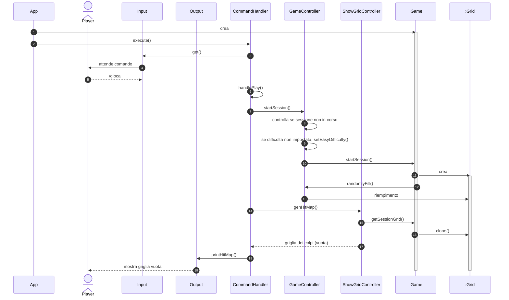
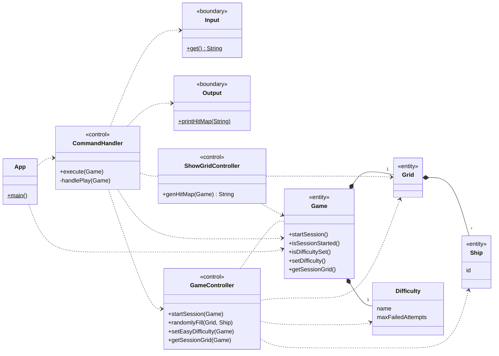
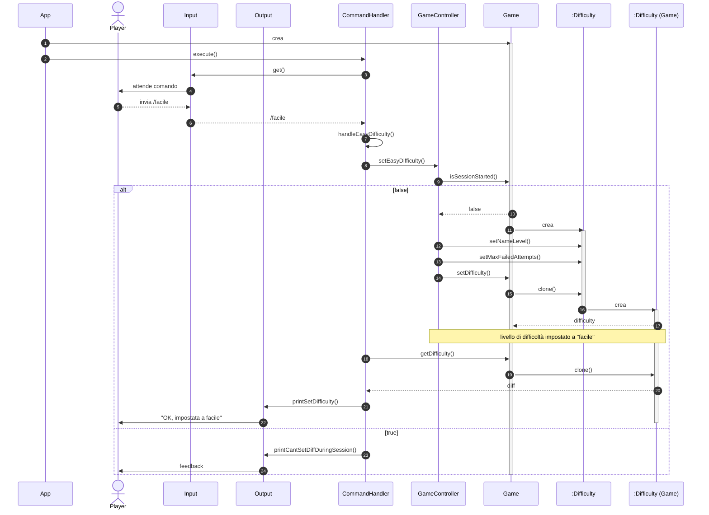
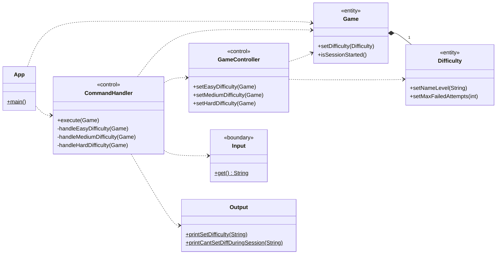
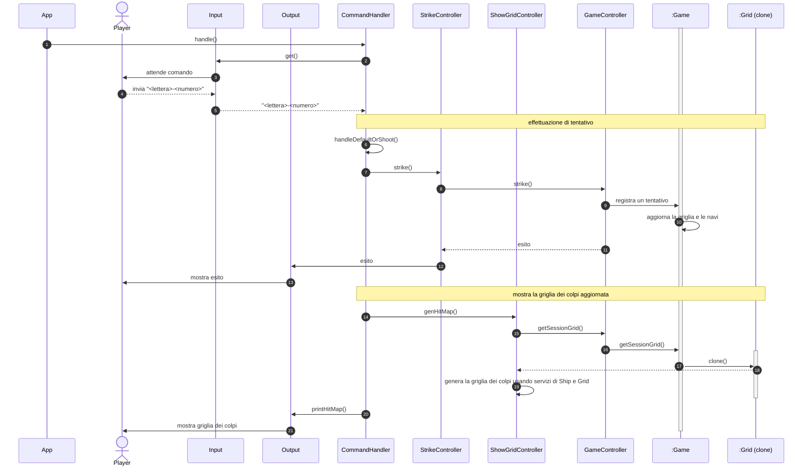
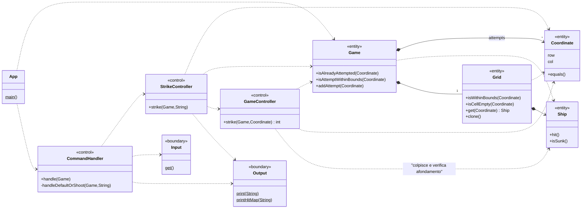
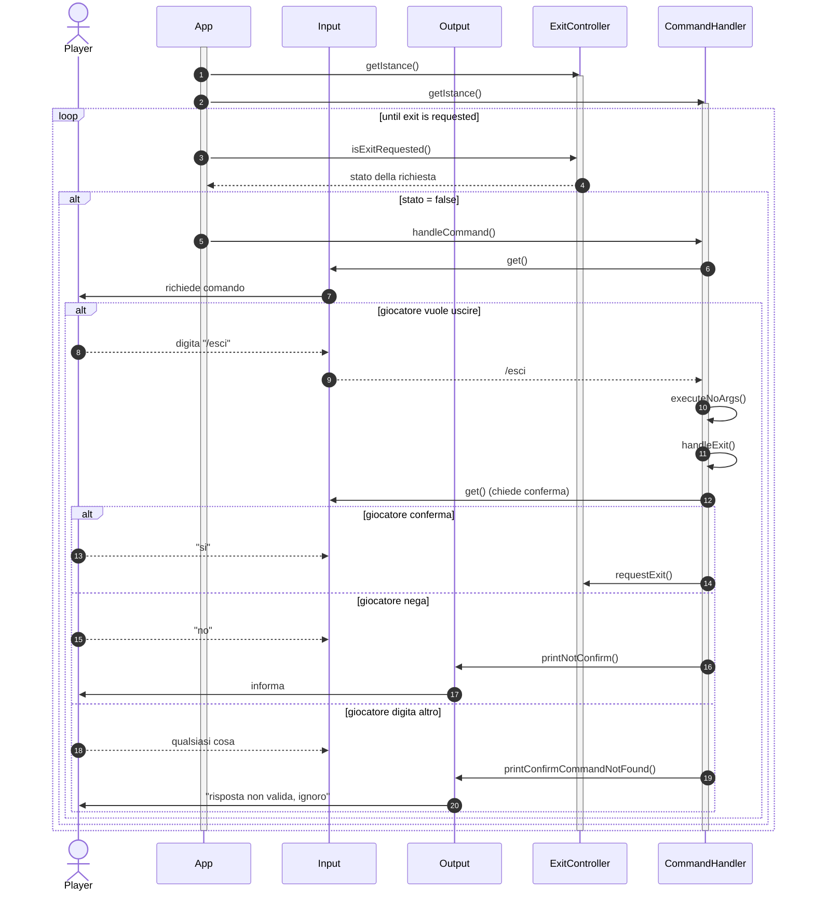
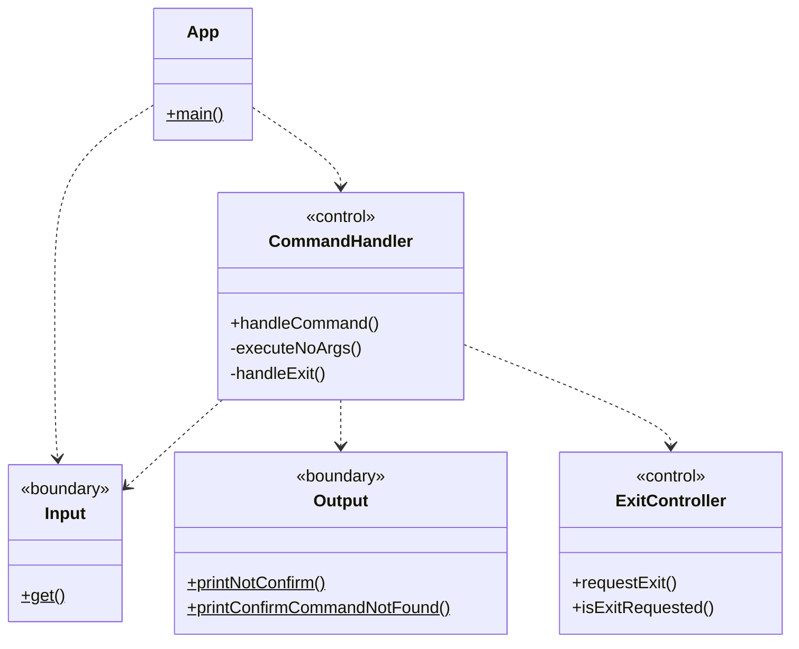

# Report

## (1) Introduzione
_Benvenuti_ nel progetto di *Battaglia Navale!* La nostra **BattleShip** offre un'esperienza di gioco solitario contro un avversario virtuale, il computer. Potete scegliere tra diverse modalità di gioco, inclusi i livelli di difficoltà: `facile`, `medio` e `difficile`. Ogni modalità prevede un numero massimo di tentativi, rispettivamente 50, 30 e 10.

Il gioco si svolge su due mappe di dimensione `10x10`: una mappa dedicata ai colpi e un'altra alle navi. Le celle sono identificate da coordinate che combinano **lettere** per le colonne e **numeri** per le righe. Ad esempio, la cella `F-3` si riferisce alla colonna F e alla riga 3.

Le navi vengono posizionate automaticamente utilizzando un algoritmo, rimanendo nascoste al giocatore. È possibile che due o più navi si tocchino, ma non possono sovrapporsi. Le navi occupano un numero specifico di celle in posizione verticale o orizzontale, senza diagonali.

Ci sono quattro tipi di navi con diverse dimensioni: `Cacciatorpediniere`, `Incrociatore`, `Corazzata` e `Portaerei`. Il vostro obiettivo è distruggere le navi nemiche seguendo queste quantità: `4` cacciatorpediniere, `3` incrociatori, `2` corazzate e `1` portaerei.

**Dopo aver posizionato le navi, il gioco inizia**. Ogni turno, il giocatore sceglie una cella da colpire, come ad esempio `A-8` per la prima colonna e l'ottava riga. All'inizio, la mappa dei colpi mostra un simbolo che indica che _nessuna cella è stata ancora colpita_.

Dopo ogni colpo, la mappa dei colpi viene aggiornata in base all'esito dell'attacco. Una `X` viene visualizzata se viene colpito un pezzo di nave, mentre il simbolo `~` indica l'acqua, ovvero una cella senza nave.

La _partita termina_ quando *tutte* le navi nemiche sono state affondate o quando si esauriscono i tentativi consentiti dal livello di difficoltà.

_Durante la partita, è possibile abbandonare il gioco in qualsiasi momento_. Inoltre, è possibile richiedere di rivelare la griglia del computer con le navi posizionate per avere una visione strategica della disposizione delle navi nemiche.

**Siete pronti per la sfida? Immergetevi in questa battaglia navale epica e dimostrate la vostra abilità strategica per conquistare il mare!**
## (2) Modello di Dominio

### diagramma

### Glossario degli attributi
|Attributo|Concetto di appartenenza|Descrizione|
|-|-|-|
| coordinate | Cella | coppia che individua univocamente una Cella di una Griglia. |
| dimensione | Griglia | Numero di righe e di celle per riga. Per esempio, `dimensione=10` implica $10^2$ celle. |
| dimensione | Nave | Numero di celle che la nave occupa. |
| maxFallibili | Difficoltà | Numero massimo di tentativi fallibili. |
| nome | Giocatore | Nome del giocatore |
| numFalliti | Partita| Numero corrente di tentativi falliti; Si ottiene contando il numero di istanze di Acqua relative alla Partita. |

### Note
- (Definizione) Tra *Griglia* e *Cella* vi è una **composizione**:
    - Una *Griglia* è composta da più *Celle* (vedi molteplicità `*` nel diagramma)
    - **dipendenza esistenziale**: Una *Cella* esiste solo se parte di una *Griglia*
    - **esclusività**: Una *Cella* può appartenere ad una e una sola *Griglia*
- (Notazione) Si dice fallito un *Tentativo* di tipo *Acqua*.


## (3) Requisiti Specifici
### (3.1) Requisiti funzionali
- (RF1) Il sistema deve permettere di iniziare una nuova partita.
  - (RF1.1) Al comando `/gioca` se nessuna partita è in corso l'applicazione imposta casualmente le navi, mostra la griglia vuota e si predispone a ricevere il primo tentativo o altri comandi.
- (RF2) Il sistema deve permettere di chiudere il gioco.
  - (RF1.2) Al comando `/esci` l'applicazione chiede conferma. Se la conferma è positiva, l'applicazione si chiude resitutendo il controllo al sistema operativo altrimenti si predispone a ricevere nuovi tentativi o comandi.
- (RF3) Il sistema deve permettere al giocatore di abbandonare una partita in corso.
   - (RF3.1) Al comando `/abbandona` l'applicazione chiede conferma. Se la conferma e è positiva, l'applicazione risponde visualizzando sulla griglia la posizione di tutte le navi e si predispone a ricevere nuovi comandi, altrimenti si predispone a ricevere nuovi tentativi o comandi.
- (RF3) Il sistema deve permettere di impostare, prima dell'avvio della partita, la difficoltà di gioco tra _FACILE_, _MEDIO_ e _DIFFICILE_. 
  - (RF3.1) Al comando `/facile` l'applicazione risponde con "OK" e imposta la difficoltà a FACILE.
  - (RF3.2) Al comando `/medio` l'applicazione risponde con "OK" e imposta la difficoltà a MEDIO.
  - (RF3.3) Al comando `/difficile` l'applicazione risponde con "OK" e imposta la difficoltà a DIFFICILE.
- (RF4) Il sistema, in base alla difficoltà impostata deve impostare il numero massimo di tentativi fallibili.
  - (RF4.1) Se la difficoltà è _FACILE_ il numero di default massimo di tentativi fallibili è 50.
  - (RF4.2) Se la difficoltà è _MEDIO_ il numero di default massimo di tentativi fallibili è 30.
  - (RF4.3) Se la difficoltà è _DIFFICILE_ il numero di default massimo di tentativi fallibili è 10.
- (RF5) Il sistema deve peremttere di impostare, prima dell'avvio della partita, il numero massimo di tentativi falliti per ogni difficoltà. 
   - (RF5.1) Al comando `/facile <numero>` l'applicazione risponde con "OK" e imposta a numero il numero massimo di tentativi fallibili per FACILE.
   - (RF5.2) Al comando `/medio <numero>` l'applicazione risponde con "OK" e imposta a numero il numero massimo di tentativi fallibili per MEDIO.
   - (RF5.3) Al comando `/difficile <numero>` l'applicazione risponde con "OK" e imposta a numero il numero massimo di tentativi fallibili per DIFFICILE. 
- (RF6) Il sistema deve permettere, prima dell'avvio della partita, di impostare direttamente il numero massimo di tentativi bypassando le difficoltà disponibili.
   - (RF6.1) Al comando `/tentativi <numero>` l'appliczione risponde con "OK" e imposta a numero il numero massimo di tentativi fallibili.
- (RF7) Il sistema deve permetter di mostrare il numero di tentativi già effettuati e il numero di tentativi falliti.
   - (RF7) Al comando `/mostratentativi` l'applicazione risponde visualizzando il numero di tentativi già effettuati, il numero di tentativi falliti e il numero massimo di tentativi falliti.
- (RF8) Il sistema deve permettere di mostrare il livello di difficoltà in uso e il numero massimo di tentativi falliti.
   - (RF8.1) Al comando `/mostralivello` l'applicazione risponde visualizzando il livello di difficoltà in uso e il numero massimo di tentativi falliti.
- (RF9) Il sistema deve permettere di impostare, prima dell'avvio del gioco, la taglia della griglia. In particolare:
   - (RF9.1) Al comando `/standard` l'applicazione risponde con "OK" e imposta 10x10 la dimensione della griglia. Nel caso in cui il giocatore decide di avviare la partita senza impostre la griglia, per default verrà scelto il caso standard (10x10).
   - (RF9.2) Al comando `/large` l'applicazione risponde con "OK" e imposta a 18x18 la dimensione della griglia.
   - (RF9.3) Al comando `/extralarge` l'applicazione risponde con "OK" e imposta a 26x26 la dimensione della griglia.
- (RF10) Il sistema deve permettere di mostrare i tipi di nave e il numero.
   - (RF10.1) Al comando `/mostranavi` l'applicazione risponde visualizzando, per ogni tipo di nave, la dimensione e il numero di esemplari da affondare.
- (RF11) Il sistema deve peremttere di svelare la griglia con le navi posizionate.
   - (RF11.1) Al comando `/svelagriglia` l'applicazione risponde visualizzando la griglia, con le righe numerate in numeri e le colonne in lettere, e tutte le navi posizionate.
- (RF12) Il sistema deve permettere di mostare la griglia con le navi colpite e affondate.
   - (RF12.1) Al comando `/mostragriglia` l'applicazione risponde visualizzando, una griglia con le righe numerate a partire da 1 e le colonen numerate a partire da A, con le navi affondate e le sole parti già colpite delle navi non affondate.
- (RF13) Il sistema deve permettere di impostare, prima dell'avvio della partita, il tempo di gioco. In particolare:
   - (RF13.1) Al comando `/tempo numero` l'applicazione risponde con "OK" e imposta a numero il numero di minuti a disposizione per giocare.
- (RF14) Il sistema deve permettere di mostrare il numero di minuti trascorsi nel gioco e il numero di minuti ancora disponibili.
  - (RF14.1) Al comando `/mostratempo` l'applicazione risponde visualizzando il numero di minuti trascorsi nel gioco e il numero di minuti ancora disponibili.
- (RF15) Il sistema deve permettere di effettuare un tentativi per colpire una nave.
   - (RF15.1) Digitando una coppia di caratteri separati da un trattino, corrispondenti rispettivamente  alla _lettera della colonna_ e al _numero di riga_ (es: `B-4`), l'applicazione risponde con
       - "**acqua**" se sulla cella non è posizionata nessuna nave.
       - "**colpito**" se sulla cella è posizionata una nave non affondata.
       - "**colpito e affondato**" se sulla cella è posizionata una nave ed è l'ultima cella non colpita occupata da essa.
   - (RF15.2) Qualunque sia l'esito del tentativo, l'applicazione deve mostrare la griglia con le navi colpite parzialmente o affondate, il numero di tentativi già effettuati e il tempo trascorso dall'inizio della partita.
   - (RF15.3) La partita termina con successo se il tentativo ha affondato l'ultima nave.
   - (RF15.4) La parita termina con insuccesso se è stato raggiunto il numero massimo di tentativi falliti o se è scaduto il tempo di gioco.
- (RF16) Il sistema deve permettere di elencare i comandi leciti per interagire con esso. I comandi del gioco sono:
  - (RF16.1) `/help`: mostra l'elenco dei comandi leciti. Il sistema deve mostrare l'elenco dei comandi leciti.
  - (RF16.2) `/gioca`: avvia una nuova partita.
  - (RF16.3) `/esci`: chiude l'applicazione.
  - (RF16.4) `/abbandona` : esce dala partita in corso.
  - (RF16.5) `/facile`: imposta la difficoltà di gioco a _FACILE_.
  - (RF16.6) `/medio`: imposta la difficoltà di gioco a _MEDIO_.
  - (RF16.7) `/difficile`: imposta la difficoltà di gioco a _DIFFICILE_.
  - (RF16.8) `/facile numero` : imposta a numero il numero massimo di tentativi fallibili per _FACILE_.
  - (RF16.9) `/medio numero` : imposta a numero il numero massimo di tentativi fallibili per _MEDIO_.
  - (RF16.10) `/difficile numero` : imposta a numero il numero massimo di tentativi fallibili per _DIFFICILE_.
  - (RF16.11) `/tentativi numero` : imposta a numero il numero di tentativi fallibili.
  - (RF16.12) `/mostratentativi` : visualizza il numero di tentativi già effettuati, quelli falliti e il numero massimo di quelli fallibili.
  - (RF16.13) `/mostralivello` : visualizza il livello di difficoltà selezionato e il numero massimo di tentativili falliti.
  - (RF16.14) `/standard` : imposta la griglia a **10x10**.
  - (RF16.15) `/large` : imposta la griglia a **18x18**.
  - (RF16.16) `/extralarge` : imposta la griglia a **26x26**.
  - (RF16.17) `/mostranavi`: visualizza per ogni tipo di nave il nome, la dimensione in quadratini e il numero di esemplari da affondare.
  - (RF16.18) `/svelagriglia`: svela la posizione delle navi nella griglia della partita in corso.
  - (RF16.19) `/mostragriglia` : mostra una griglia con le sole navi affondate o in parte colpite.
  - (RF16.20) `/tempo numero`: imposta a numero il numero di minuti a disposizione per giocare.
  - (RF16.21) `/mostratempo` : visualizza il numero di minuti trascorso dall'avvio della partita e il numero di minuti ancora disponibili.
  - (RF16.22) `COL-ROW` : lancia un colpo in posizione riga `ROW` e colonna `COL`.
### (3.2) Requisiti non funzionali
- (RNF1) Il container docker dell'app deve essere eseguito da terminali che supportano Unicode con encoding UTF-8 e UTF-16.
  - (RNF1.1) Per linux e macos si consiglia di utilizzare il terminale di default.
  - (RNF1.2) Per Windows si consiglia di utilizzare Powershell o il terminale di git bash.
- (RNF2) Per eseguire il container docker dell'app è necessario:
  - (RNF2.1) Avere installato docker sul proprio sistema operativo.
  - (RNF2.2) Eseguire il comando `docker pull ghcr.io/softeng2223-inf-uniba/battleship-thacker:latest`.
  - (RNF2.3) Eseguire il container docker con il comando `docker run --rm -it ghcr.io/softeng2223-inf-uniba/battleship-thacker:latest`.
- (RNF3) Il sistema deve essere sviluppato in Java utilizzando la JDK 19.

## (5) Object Oriented Design 

### (5.A) Diagrammi per user-story rilevanti

Nei seguenti diagrammi di classe, è omessa la visibilità degli attributi perchè sottointesa quella privata (-): Il sistema infatti è stato progettato per osservare il principio di *incapsulamento* e *information hiding*.

Seguono i diagrammi di classe e di sequenza per le userstory più importanti.

#### (5.A.1) Come _giocatore_ voglio _iniziare una partita_

Pullrequest: #79

Issue: #29

**Attori**: giocatore (o Player)

**Caso d'uso:**

Il giocatore, se non vi è una sessione di gioco in corso, eseguendo il comando `/gioca` è in grado di iniziare una nuova partita e di visualizzare la griglia dei colpi (inizialmente vuota).

Da quel momento in poi sarà possibile, oltre agli altri comandi, effettuare tentativi per colpire una nave.

**diagramma di sequenza**



**diagramma delle classi**



#### (5.A.2) Come _giocatore_ voglio _impostare la difficoltà_

Pullrequest: #58

Issue: #22

**Attore:** giocatore

**Caso d'uso:**
Il giocatore, prima di iniziare una partita può impostare un livello di difficoltà attraverso uno dei seguenti comandi:
- `/facile` : livello facile
- `/medio` : livello medio
- `/difficile` : livello difficile

Se dovesse eseguire uno di questi comandi durante una partita, il sistema notificherà il giocatore dell'impossibilità nell'eseguire quella azione.

**diagramma di sequenza:**


**diagramma delle classi:**



#### (5.A.3) Come _giocatore_ voglio _effettuare un tentativo_ per _colpire una nave_

Issue: #109

**Attori**: giocatore (o _Player_)

**Caso d'uso**:

Il giocatore, dopo aver avviato una nuova partita digita una combinazione *lettera* e *numero* nel formato `<lettera>-<numero>` (per esempio `A-1` o `a-1`) per scegliere la cella da colpire (tentativo per colpire una nave), se non già colpita.
A quel punto il sistema informa il giocatore dell'esito del tentativo: "_acqua_", "_colpito_" o "_(colpito e) affondato_" per poi mostrare la griglia dei colpi aggiornata.

**Condizioni di partenza**:

- l'attore _Player_ ha già effettuato il comando `/gioca` e quindi avviato una sessione di gioco
- l'attore _Player_ digita una coordinata lecita (formato `<lettera>-<numero>`) nella comunicazione con _Input_

**diagramma di sequenza**


**diagramma delle classi**


**Note:**
Si osservi che, nel diagramma di sequenza, dopo la stampa dell'esito del tentativo, i passaggi successivi sono gli stessi previsti dalla user story [110](https://github.com/softeng2223-inf-uniba/progetto2223-thacker/issues/110) (mostrare la griglia dei colpi).
Di conseguenza anche il diagramma delle classi comprende le relazioni coinvolte nella 110.

#### (5.A.4) come _giocatore voglio_ poter _chiudere il gioco_

Issue: [21](https://github.com/softeng2223-inf-uniba/progetto2223-thacker/issues/21)

**Attori**: giocatore (Player)

**Caso d'uso:**
il giocatore deve poter uscire dalla applicazione attraverso un comando lecito, invece di terminare il processo dell'applicazione per vie alternative.
Pertanto, attraverso il comando `/esci`, il giocatore, previa conferma, può chiudere l'applicazione.

**diagramma di sequenza**



**diagramma delle classi**



### (5.B) Design pattern applicati

Per le classi di tipo control (individuabili nel codice con il suffisso Controller e/o dall'etichetta `<<control>>` nel relativo javadoc) è stato applicato il design pattern "Singleton", come da convenzione.

### (5.C) Commenti sulle decisioni prese

#### Information Hiding

Ogni classe nasconde la propria struttura all'esterno, ovvero tutte le variabili di istanza sono private (**incapsulamento**).
Di conseguenza. lo stato degli oggetti istanziati viene modificato solo attraverso le operazioni lecite (metodi pubblici) della classe di appartenenza.

Per quanto riguarda i **package**:

- `it.uniba.app.battleship` : tutte le classi sono visibili all'esterno, essendo un modulo progettato come una API flessibile che altri componenti esterni possono sfruttare per realizzare la propria versione del gioco (vedi sezione successiva _Presentazione separata_)

- `it.uniba.app.commandline` : Poichè questo modulo è realizzato ad hoc per sfruttare l'API di `battleship` per giocare da linea di comando sono state rese visibili solo alcune classi (_CommandHandler, FlagHandler, ExitController, HelpController_) necessarie a _App_ in (`it.uniba.app`) per avviare i gestori.

#### Presentazione separata

Il sistema è stato sviluppato tenendo conto della necessità di separare la _logica di dominio_ (battaglia navale solitario, con tutte le proprietà che appartengono al suo dominio) dalla _logica di presentazione_ (interazione con il terminale per giocare).

Questa separazione è stata implementata suddividendo le classi in due package:

- `it.uniba.app.battleship` : logica di dominio
- `it.uniba.app.commandline` : logica di presentazione

Questa suddivisione consentirebbe in futuro di riutilizzare i servizi offerti dal package `battleship` per realizzare una presentazione diversa (interfaccia grafica, ad esempio).

#### Do Not Repeat Yourself (DRY)

Il team di sviluppo ha tenuto conto del principio DRY, il quale suggerisce che una certa funzionalità (operazione, procedura, etc..) debba essere astratta a tal punto da poter essere riutilizzata ovunque ce ne dovesse essere bisogno, evitando quindi di scrivere codice duplicato.

#### Accoppiamento e Coesione

Sia in fase di concezione di ogni classe, sia in quella di sviluppo, ci si è interrogati sulle responsabilità tali classi avrebbero dovuto/debbano avere e si sono prese determinate decisioni.

Abbiamo limitato il più possibile l'accoppiamento tra classi (il grado di dipendenza di una classe da altre) in modo tale che future modifiche in una non comportassero grossi cambiamenti in altre.

D'altro canto abbiamo cercato di rendere le classi coese, non assegnandoli troppe responsabiltà.

Laddove questo non è stato fatto fino in fondo, perlomeno si è reso il componente di appartenza ad alta coesione e basso (o nullo) accoppiamento (si osservi la struttura del package `battleship`, sezione 4).


## (7) Manuale Utente

### **(7.1) Prerequisiti**
Al fine di garantire una corretta esecuzione del programma su qualsiasi macchina, evitando dunque imcompatibilità varie, è necessaria l'installazione preventiva della piattaforma Docker.

#### **(7.1.1) Installazione Docker**

La prima cosa da fare è scaricare il contenuto di uno dei link riportati di seguito, a seconda della versione del sistema operativo che si sta usando : 

<span style="text-align:center">

[Linux](https://docs.docker.com/desktop/linux/install/)

[Apple](https://desktop.docker.com/mac/main/amd64/Docker.dmg?utm_source=docker&utm_medium=webreferral&utm_campaign=dd-smartbutton&utm_location=module)

[Windows](https://desktop.docker.com/win/main/amd64/Docker%20Desktop%20Installer.exe?utm_source=docker&utm_medium=webreferral&utm_campaign=dd-smartbutton&utm_location=module)

</span>

Dopodiché, bisognerà eseguire il file appena scaricato (.exe per Windows, .dmg per Apple) e installare 
Docker.

#### **(7.1.2) Installazione WSL (Windows)**

Se si sta cercando di eseguire il programma su una macchina con MacOS o Linux, si può saltare questo passaggio.

Se,invece, si sta utilizzando Windows, Docker non funzionerà se prima non verrà installato il Windows Subsystem Linux. Sarà necessario solamente scrivere la seguente riga all'interno di un qualsiasi terminale: 

```sh
wsl --install + LINUX
```
Dove al posto di LINUX andrà la distribuzione di vostro gradimento. 

Per visualizzare un elenco delle distro Linux supportate nella WSL basterà digitare sempre da terminale: 
```sh
wsl --list --online 
```
#### **(7.1.3) Esecuzione immagine Docker** 

Una volta installato Docker (e il WSL, per gli utenti Windows) andrà eseguita l'immagine creata da Docker.  

Per fare questo, basterà eseguire i passaggi di sotto indicati in maniera sequenziale: 

- Avviare il programma Docker 
- Autenticare Docker per Github Packages  
  - creare un file di testo con al suo interno il _personal access token_ di Github ([Istruzioni per la loro creazione](https://docs.github.com/en/authentication/keeping-your-account-and-data-secure/creating-a-personal-access-token))
  - digitare il seguente comando  
    ```sh 
    cat ./TOKEN.txt | docker login ghcr.io -u <USERNAME> --password-stdin 
    ```
    Sostituendo `./TOKEN.txt` con il percorso dove è stato salvato il file di testo e `<USERNAME>` con il proprio username di Github.
- Copiare il package di Docker della repo di riferimento:
  
  - Recarsi nella sezione  principale della repo e cliccare sul nome dell'immagine Docker, sotto la sezione **Packages**
  - Copiare il comando tramite l'apposito pulsante ed incollarlo nel terminale 
  - Eseguire il comando per scaricare l'immagine 
- Digitare il comando 
  ```sh 
  docker run --rm -it <nome_immagine>
  ```
  Sostituendo ``<nome_immagine>`` con il nome dell'immagine Docker di riferimento. 

Una effettuati questi passaggi, il programma sarà **pronto** per essere eseguito. 

#### (7.2) Incominciare il gioco

Eseguita l'immagine Docker, il giocatore si troverà davanti una schermata in cui potrà digitare **due comandi**. 

#### (7.2.1) Elenco dei comandi 

```sh
/help o --help o -h
```

  Con il seguente comando verranno mostrati a schermo tutti i comandi utilizzabili di cui segue una breve descrizione di ognuno: 


  - ``/gioca`` permette di iniziare una nuova partita;
  - ``/facile`` imposta il livello di difficoltà su facile, quindi si avranno a disposizione massimo 50 tentativi a vuoto   
  - ``/medio`` imposta il livello di difficoltà su medio, quindi si avranno a disposizione massimo 30 tentativi a vuoto   
  - ``/difficile`` imposta il livello di difficoltà su difficile, quindi si avranno a disposizione massimo 10 tentativi a vuoto   
  - ``/mostralivello`` permette di mostrare, durante una partita, il livello di difficoltà 
  - ``/svelagriglia`` permette di mostrare la griglia dell'avversario 
  - ``/mostranavi`` mostra il nome delle navi, la loro rappresentazione nel gioco e la loro rispettiva quantità disponibile, come riportato nella seguente tabella: 

      |Nome|Numero esemplari|
      |-|-|
      | Cacciatorpediniere   | 4 |
      | Incrociatore  | 3 |
      | Corazzata  | 2 |
      | Portaerei  | 1 |   

  - ``/esci`` permette di terminare l'esecuzione del programma, dietro previa conferma


#### (7.2.2) Inizio di una partita

```
/gioca
```
Con questo comando sarà possibile iniziare una nuova partita. Una volta eseguito questo comando, verranno disposte, in maniera casuale, tutte le navi.

#### (7.2.3) Posizionare le navi

Le navi verranno posizionate in maniera **automatica** in una griglia di dimensione 10x10, senza il bisogno dell'intervento del giocatore. 

Le righe della griglia saranno numerate da 1 a 10, mentre le sue colonne saranno contrassegnate dalle lettere dalla A alla J. 


#### (7.2.4) Sistema dei colpi

Se il colpo lanciato dall'utente colpisce una casella **vuota**, sulla griglia verrà mostrato il simbolo **"~"**. Se, invece, colpisce una nave, verrà mostrata una **"X"** nella casella colpita. 

Quando non rimane più nessuna cella, della nave colpita,intatta,essa potrà essere dichiarata **affondata**. 

### (7.2) Scopo del gioco

L'obiettivo del giocatore è quello di affondare le navi nemiche prima di esaurire tutti i tentativi dettati dalla difficoltà impostata in fase di preparazione  della partita. 

## (9) Analisi Retrospettiva
All'interno di questa sezione si trovano le relazioni dei vari Sprint che verranno eseguiti durante lo sviluppo del progetto.
### (9.1) Sprint 0

Relazione del meeting del gruppo Thacker riguardo ciò che è accaduto durante lo Sprint 0.
Meeting avvenuto il giorno 14/04/2023
**Partecipanti al meeting:**
- Federico Armagno
- Annarita Bruno
- Vito Stefano Birardi
- Alessandro Carli
- Giovanni Cirigliano
- Antonio Dambra
- Giuseppe D'Urso
  
**Relazione:**
Con lo Sprint 0 il gruppo Thacker ha avuto il primo approccio con le varie dinamiche della piattaforma GitHub ottenendo diversi riscontri.

In questo meeting abbiamo affrontato diversi punti chiave riguardanti la pianificazione, la gestione delle emozioni, le modifiche dell'ultimo minuto e le esperienze individuali all'interno del gruppo. Di seguito, riassumo i principali argomenti discussi.

- Giovanni Cirigliano ha sostenuto la necessità di dedicare più tempo alla fase di pianificazione nei prossimi sprint. Ha evidenziato che una pianificazione approfondita è fondamentale per garantire una maggiore chiarezza sulle attività e sui tempi di consegna. La sua proposta è stata accolta positivamente dal resto del team, che ha riconosciuto l'importanza di una pianificazione solida per il successo del progetto.

- Antonio Dambra ha espresso la sua insoddisfazione riguardo alla gestione delle emozioni in alcune circostanze. Ha evidenziato la necessità di mantenere la calma anche durante situazioni stressanti o conflittuali. Il team ha riconosciuto l'importanza di gestire le emozioni in modo efficace.

- Annarita Bruno ha condiviso la sua insoddisfazione riguardo al fatto che, a causa del poco tempo a disposizione, si è dovuto affrontare un numero elevato di modifiche dell'ultimo minuto. Ha evidenziato come ciò abbia comportato un carico di lavoro aggiuntivo e rallentato il progresso generale del progetto. Il team ha riconosciuto l'importanza di una pianificazione accurata per ridurre le modifiche dell'ultimo minuto e ha discusso di strategie per migliorare la gestione del tempo e delle attività.

- Antonio Dambra si è mostrato entusiasta di lavorare in gruppo, definendolo un'esperienza potenzialmente esaltante. Ha sottolineato l'importanza di creare un ambiente di lavoro positivo e collaborativo, in cui i membri del team si sentano motivati e valorizzati.

- Federico Armagno ha ammesso che spesso,nei primi giorni di lavoro,ha avuto delle sviste per quanto riguarda lo spostare le issue nei vari stati (To Do, In progress, ecc...). Il team ha riconosciuto l'importanza di mantenere traccia dello stato delle attività per una migliore fluidità ed organizzazione del lavoro.

- Giuseppe D'Urso ha sostenuto che lo sprint 0 è stata un'esperienza utile per familiarizzare con le dinamiche di GitHub. Il team ha condiviso l'importanza di acquisire confidenza con gli strumenti utilizzati nel progetto e ha apprezzato l'impegno di Giuseppe nel comprendere l'ambiente di GitHub.

- Alessandro Carli ha espresso qualche disagio iniziale riguardo al meccanismo di creazione dei branch su GitHub durante questo sprint. Tuttavia, si è dimostrato soddisfatto della collaborazione con il collega Giuseppe D'Urso per la redazione del documento `ISPIRATORE.md`, riconoscendo una perfetta suddivisione del lavoro e una collaborazione efficace.

- Vito Stefano Birardi ha espresso la sua insoddisfazione riguardo la procedura di creazione delle issue nella propria repository GitHub. Il team ha preso atto della sua preoccupazione e si è impegnato a fornire un supporto adeguato per migliorare la procedura e rendere più agevole la creazione delle issue.

In conclusione, il meeting del team ha offerto l'opportunità di affrontare diverse questioni critiche per migliorare la pianificazione, la gestione delle emozioni e la comunicazione interna. Il team ha dimostrato un'impegno comune nel lavorare insieme per affrontare queste sfide e ha apprezzato le esperienze positive di collaborazione emerse durante lo sprint 0.
