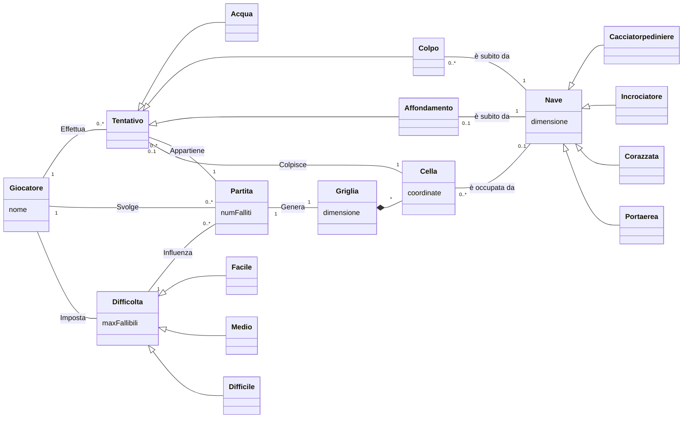

# Report

## (1) Introduzione
_Benvenuti_ nell'introduzione del progetto di **Battaglia Navale**.  
La nostra **BattleShip** permette di giocare in solitaria contro un giocatore virtuale (il computer).  

Ci sono varie modalità di gioco: facile, medio e difficile.
In ogni modalità vi è un numero massimo di tentativi fallibili: 
- Difficoltà `facile`: 50. 
- Difficoltà `media`: 30. 
- Difficoltà `difficile`: 10.
## (2) Modello di Dominio

### diagramma

### Glossario degli attributi
|Attributo|Concetto di appartenenza|Descrizione|
|-|-|-|
| coordinate | Cella | coppia che individua univocamente una Cella di una Griglia. |
| dimensione | Griglia | Numero di righe e di celle per riga. Per esempio, `dimensione=10` implica $10^2$ celle. |
| dimensione | Nave | Numero di celle che la nave occupa. |
| maxFallibili | Difficoltà | Numero massimo di tentativi fallibili. |
| nome | Giocatore | Nome del giocatore |
| numFalliti | Partita| Numero corrente di tentativi falliti; Si ottiene contando il numero di istanze di Acqua relative alla Partita. |

### Note
- (Definizione) Tra *Griglia* e *Cella* vi è una **composizione**:
    - Una *Griglia* è composta da più *Celle* (vedi molteplicità `*` nel diagramma)
    - **dipendenza esistenziale**: Una *Cella* esiste solo se parte di una *Griglia*
    - **esclusività**: Una *Cella* può appartenere ad una e una sola *Griglia*
- (Notazione) Si dice fallito un *Tentativo* di tipo *Acqua*.

## (3) Requisiti Specifici
### (3.1) Requisiti funzionali
- (RF1) Il sistema deve permettere di creare una nuova partita.
- (RF2) Il sistema deve permettere di chiudere l'applicazione.
- (RF3) Il sistema deve permettere di impostare la difficoltà di gioco tra _FACILE_, _MEDIO_ e _DIFFICILE_. 
- (RF4) Il sistema, in base alla difficoltà impostata deve impostare il numero massimo di tentativi fallibili.
- (RF5) Il sistema imposta i tentativi fallibili nel seguente modo:
  - (RF5.1) Se la difficoltà è _FACILE_ il numero massimo di tentativi fallibili è 50.
  - (RF5.2) Se la difficoltà è _MEDIO_ il numero massimo di tentativi fallibili è 30.
  - (RF5.3) Se la difficoltà è _DIFFICILE_ il numero massimo di tentativi fallibili è 10.
- (RF6) Il sistema deve permettere di mostrare il livello di difficoltà impostato.
- (RF7) Il sistema deve permettere di svelare le posizioni delle navi nella griglia della partita in corso
- (RF8) Il sistema deve permettere di mostrare i tipi di navi presenti nel gioco, specificandone il numero di esemplari possibili.
- (RF9) Il sistema deve permettere di elencare i comandi leciti per interagire con esso. I comandi del gioco sono:
  - (RF9.1) `/help`: mostra l'elenco dei comandi leciti. Il sistema deve mostrare l'elenco dei comandi leciti.
  - (RF9.2) `/gioca`: avvia una nuova partita.
  - (RF9.3) `/esci`: chiude l'applicazione.
  - (RF9.4) `/facile`: imposta la difficoltà di gioco a _FACILE_.
  - (RF9.5) `/medio`: imposta la difficoltà di gioco a _MEDIO_.
  - (RF9.6) `/difficile`: imposta la difficoltà di gioco a _DIFFICILE_.
  - (RF9.7) `/mostranavi`: visualizza per ogni tipo di nave il nome, la dimensione in quadratini e il numero di esemplari da affondare.
  - (RF9.8) `/mostralivello`: visualizza il livello di difficoltà impostato e il numero massimo di tentativi fallibili.
  - (RF9.9) `/svelagriglia`: svela la posizione delle navi nella griglia della partita in corso.
### (3.2) Requisiti non funzionali
- (RNF1) Il container docker dell'app deve essere eseguito da terminali che supportano Unicode con encoding UTF-8 e UTF-16.
  - (RNF1.1) Per linux e macos si consiglia di utilizzare il terminale di default.
  - (RNF1.2) Per Windows si consiglia di utilizzare Powershell o il terminale di git bash.
- (RNF2) Per eseguire il container docker dell'app è necessario:
  - (RNF2.1) Avere installato docker sul proprio sistema operativo.
  - (RNF2.2) Eseguire il comando `docker pull ghcr.io/softeng2223-inf-uniba/battleship-thacker:latest`.
  - (RNF2.3) Eseguire il container docker con il comando `docker run --rm -it ghcr.io/softeng2223-inf-uniba/battleship-thacker:latest`.
- (RNF3) Il sistema deve essere sviluppato in Java utilizzando la JDK 19.

## (7) Manuale Utente

## (9) Analisi Retrospettiva
### (9.1) Sprint 0

