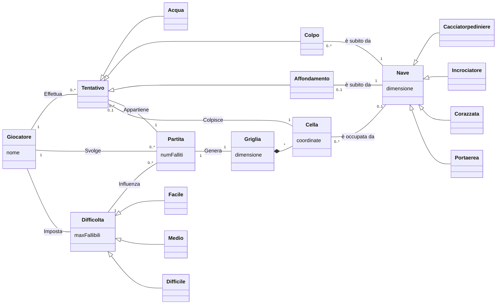

# Report

## (1) Introduzione
_Benvenuti_ nel progetto di *Battaglia Navale!* La nostra **BattleShip** offre un'esperienza di gioco solitario contro un avversario virtuale, il computer. Potete scegliere tra diverse modalità di gioco, inclusi i livelli di difficoltà: `facile`, `medio` e `difficile`. Ogni modalità prevede un numero massimo di tentativi, rispettivamente 50, 30 e 10.

Il gioco si svolge su due mappe di dimensione `10x10`: una mappa dedicata ai colpi e un'altra alle navi. Le celle sono identificate da coordinate che combinano **lettere** per le colonne e **numeri** per le righe. Ad esempio, la cella `F-3` si riferisce alla colonna F e alla riga 3.

Le navi vengono posizionate automaticamente utilizzando un algoritmo, rimanendo nascoste al giocatore. È possibile che due o più navi si tocchino, ma non possono sovrapporsi. Le navi occupano un numero specifico di celle in posizione verticale o orizzontale, senza diagonali.

Ci sono quattro tipi di navi con diverse dimensioni: `Cacciatorpediniere`, `Incrociatore`, `Corazzata` e `Portaerei`. Il vostro obiettivo è distruggere le navi nemiche seguendo queste quantità: `4` cacciatorpediniere, `3` incrociatori, `2` corazzate e `1` portaerei.

**Dopo aver posizionato le navi, il gioco inizia**. Ogni turno, il giocatore sceglie una cella da colpire, come ad esempio `A-8` per la prima colonna e l'ottava riga. All'inizio, la mappa dei colpi mostra un simbolo che indica che _nessuna cella è stata ancora colpita_.

Dopo ogni colpo, la mappa dei colpi viene aggiornata in base all'esito dell'attacco. Una `X` viene visualizzata se viene colpito un pezzo di nave, mentre il simbolo `~` indica l'acqua, ovvero una cella senza nave.

La _partita termina_ quando *tutte* le navi nemiche sono state affondate o quando si esauriscono i tentativi consentiti dal livello di difficoltà.

_Durante la partita, è possibile abbandonare il gioco in qualsiasi momento_. Inoltre, è possibile richiedere di rivelare la griglia del computer con le navi posizionate per avere una visione strategica della disposizione delle navi nemiche.

**Siete pronti per la sfida? Immergetevi in questa battaglia navale epica e dimostrate la vostra abilità strategica per conquistare il mare!**
## (2) Modello di Dominio

### diagramma

### Glossario degli attributi
|Attributo|Concetto di appartenenza|Descrizione|
|-|-|-|
| coordinate | Cella | coppia che individua univocamente una Cella di una Griglia. |
| dimensione | Griglia | Numero di righe e di celle per riga. Per esempio, `dimensione=10` implica $10^2$ celle. |
| dimensione | Nave | Numero di celle che la nave occupa. |
| maxFallibili | Difficoltà | Numero massimo di tentativi fallibili. |
| nome | Giocatore | Nome del giocatore |
| numFalliti | Partita| Numero corrente di tentativi falliti; Si ottiene contando il numero di istanze di Acqua relative alla Partita. |

### Note
- (Definizione) Tra *Griglia* e *Cella* vi è una **composizione**:
    - Una *Griglia* è composta da più *Celle* (vedi molteplicità `*` nel diagramma)
    - **dipendenza esistenziale**: Una *Cella* esiste solo se parte di una *Griglia*
    - **esclusività**: Una *Cella* può appartenere ad una e una sola *Griglia*
- (Notazione) Si dice fallito un *Tentativo* di tipo *Acqua*.

## (3) Requisiti Specifici
### (3.1) Requisiti funzionali
- (RF1) Il sistema deve permettere di creare una nuova partita.
- (RF2) Il sistema deve permettere di chiudere l'applicazione.
- (RF3) Il sistema deve permettere di impostare la difficoltà di gioco tra _FACILE_, _MEDIO_ e _DIFFICILE_. 
- (RF4) Il sistema, in base alla difficoltà impostata deve impostare il numero massimo di tentativi fallibili.
- (RF5) Il sistema imposta i tentativi fallibili nel seguente modo:
  - (RF5.1) Se la difficoltà è _FACILE_ il numero massimo di tentativi fallibili è 50.
  - (RF5.2) Se la difficoltà è _MEDIO_ il numero massimo di tentativi fallibili è 30.
  - (RF5.3) Se la difficoltà è _DIFFICILE_ il numero massimo di tentativi fallibili è 10.
- (RF6) Il sistema deve permettere di mostrare il livello di difficoltà impostato.
- (RF7) Il sistema deve permettere di svelare le posizioni delle navi nella griglia della partita in corso
- (RF8) Il sistema deve permettere di mostrare i tipi di navi presenti nel gioco, specificandone il numero di esemplari possibili.
- (RF9) Il sistema deve permettere di elencare i comandi leciti per interagire con esso. I comandi del gioco sono:
  - (RF9.1) `/help`: mostra l'elenco dei comandi leciti. Il sistema deve mostrare l'elenco dei comandi leciti.
  - (RF9.2) `/gioca`: avvia una nuova partita.
  - (RF9.3) `/esci`: chiude l'applicazione.
  - (RF9.4) `/facile`: imposta la difficoltà di gioco a _FACILE_.
  - (RF9.5) `/medio`: imposta la difficoltà di gioco a _MEDIO_.
  - (RF9.6) `/difficile`: imposta la difficoltà di gioco a _DIFFICILE_.
  - (RF9.7) `/mostranavi`: visualizza per ogni tipo di nave il nome, la dimensione in quadratini e il numero di esemplari da affondare.
  - (RF9.8) `/mostralivello`: visualizza il livello di difficoltà impostato e il numero massimo di tentativi fallibili.
  - (RF9.9) `/svelagriglia`: svela la posizione delle navi nella griglia della partita in corso.
### (3.2) Requisiti non funzionali
- (RNF1) Il container docker dell'app deve essere eseguito da terminali che supportano Unicode con encoding UTF-8 e UTF-16.
  - (RNF1.1) Per linux e macos si consiglia di utilizzare il terminale di default.
  - (RNF1.2) Per Windows si consiglia di utilizzare Powershell o il terminale di git bash.
- (RNF2) Per eseguire il container docker dell'app è necessario:
  - (RNF2.1) Avere installato docker sul proprio sistema operativo.
  - (RNF2.2) Eseguire il comando `docker pull ghcr.io/softeng2223-inf-uniba/battleship-thacker:latest`.
  - (RNF2.3) Eseguire il container docker con il comando `docker run --rm -it ghcr.io/softeng2223-inf-uniba/battleship-thacker:latest`.
- (RNF3) Il sistema deve essere sviluppato in Java utilizzando la JDK 19.

## (7) Manuale Utente

## (9) Analisi Retrospettiva
All'interno di questa sezione si trovano le relazioni dei vari Sprint che verranno eseguiti durante lo sviluppo del progetto.
### (9.1) Sprint 0

Relazione del meeting del gruppo Thacker riguardo ciò che è accaduto durante lo Sprint 0.
Meeting avvenuto il giorno 14/04/2023
**Partecipanti al meeting:**
- Federico Armagno
- Annarita Bruno
- Vito Stefano Birardi
- Alessandro Carli
- Giovanni Cirigliano
- Antonio Dambra
- Giuseppe D'Urso
  
**Relazione:**
Con lo Sprint 0 il gruppo Thacker ha avuto il primo approccio con le varie dinamiche della piattaforma GitHub ottenendo diversi riscontri.

In questo meeting abbiamo affrontato diversi punti chiave riguardanti la pianificazione, la gestione delle emozioni, le modifiche dell'ultimo minuto e le esperienze individuali all'interno del gruppo. Di seguito, riassumo i principali argomenti discussi.

- Giovanni Cirigliano ha sostenuto la necessità di dedicare più tempo alla fase di pianificazione nei prossimi sprint. Ha evidenziato che una pianificazione approfondita è fondamentale per garantire una maggiore chiarezza sulle attività e sui tempi di consegna. La sua proposta è stata accolta positivamente dal resto del team, che ha riconosciuto l'importanza di una pianificazione solida per il successo del progetto.

- Antonio Dambra ha espresso la sua insoddisfazione riguardo alla gestione delle emozioni in alcune circostanze. Ha evidenziato la necessità di mantenere la calma anche durante situazioni stressanti o conflittuali. Il team ha riconosciuto l'importanza di gestire le emozioni in modo efficace.

- Annarita Bruno ha condiviso la sua insoddisfazione riguardo al fatto che, a causa del poco tempo a disposizione, si è dovuto affrontare un numero elevato di modifiche dell'ultimo minuto. Ha evidenziato come ciò abbia comportato un carico di lavoro aggiuntivo e rallentato il progresso generale del progetto. Il team ha riconosciuto l'importanza di una pianificazione accurata per ridurre le modifiche dell'ultimo minuto e ha discusso di strategie per migliorare la gestione del tempo e delle attività.

- Antonio Dambra si è mostrato entusiasta di lavorare in gruppo, definendolo un'esperienza potenzialmente esaltante. Ha sottolineato l'importanza di creare un ambiente di lavoro positivo e collaborativo, in cui i membri del team si sentano motivati e valorizzati.

- Federico Armagno ha ammesso che spesso,nei primi giorni di lavoro,ha avuto delle sviste per quanto riguarda lo spostare le issue nei vari stati (To Do, In progress, ecc...). Il team ha riconosciuto l'importanza di mantenere traccia dello stato delle attività per una migliore fluidità ed organizzazione del lavoro.

- Giuseppe D'Urso ha sostenuto che lo sprint 0 è stata un'esperienza utile per familiarizzare con le dinamiche di GitHub. Il team ha condiviso l'importanza di acquisire confidenza con gli strumenti utilizzati nel progetto e ha apprezzato l'impegno di Giuseppe nel comprendere l'ambiente di GitHub.

- Alessandro Carli ha espresso qualche disagio iniziale riguardo al meccanismo di creazione dei branch su GitHub durante questo sprint. Tuttavia, si è dimostrato soddisfatto della collaborazione con il collega Giuseppe D'Urso per la redazione del documento `ISPIRATORE.md`, riconoscendo una perfetta suddivisione del lavoro e una collaborazione efficace.

- Vito Stefano Birardi ha espresso la sua insoddisfazione riguardo la procedura di creazione delle issue nella propria repository GitHub. Il team ha preso atto della sua preoccupazione e si è impegnato a fornire un supporto adeguato per migliorare la procedura e rendere più agevole la creazione delle issue.