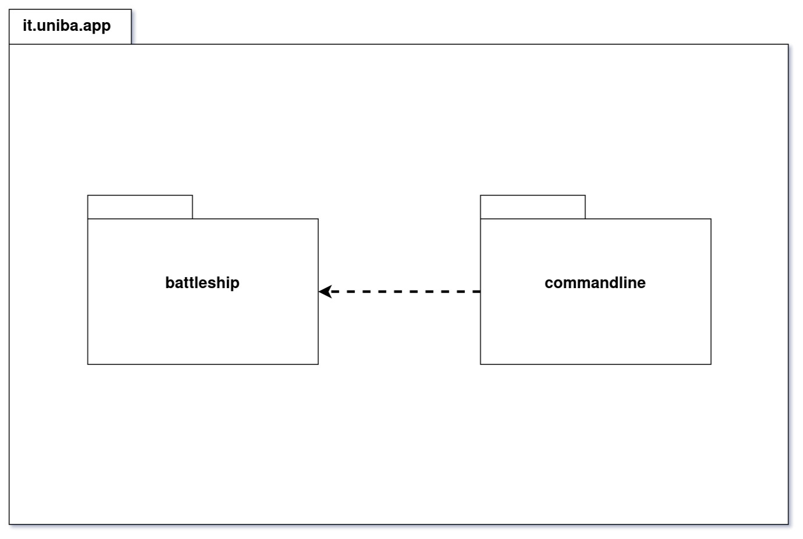
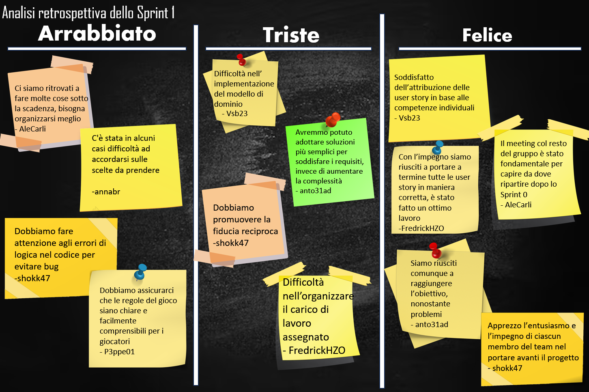

# Report

## (1) Introduzione
_Benvenuti_ nel progetto di *Battaglia Navale!* La nostra **BattleShip** offre un'esperienza di gioco solitario contro un avversario virtuale, il computer. Potete scegliere tra diverse modalità di gioco, inclusi i livelli di difficoltà: `facile`, `medio` e `difficile`. Ogni modalità prevede un numero massimo di tentativi, rispettivamente 50, 30 e 10.

Il gioco si svolge su due mappe di dimensione `10x10`: una mappa dedicata ai colpi e un'altra alle navi. Le celle sono identificate da coordinate che combinano **lettere** per le colonne e **numeri** per le righe. Ad esempio, la cella `F-3` si riferisce alla colonna F e alla riga 3.

Le navi vengono posizionate automaticamente utilizzando un algoritmo, rimanendo nascoste al giocatore. È possibile che due o più navi si tocchino, ma non possono sovrapporsi. Le navi occupano un numero specifico di celle in posizione verticale o orizzontale, senza diagonali.

Ci sono quattro tipi di navi con diverse dimensioni: `Cacciatorpediniere`, `Incrociatore`, `Corazzata` e `Portaerei`. Il vostro obiettivo è distruggere le navi nemiche seguendo queste quantità: `4` cacciatorpediniere, `3` incrociatori, `2` corazzate e `1` portaerei.

**Dopo aver posizionato le navi, il gioco inizia**. Ogni turno, il giocatore sceglie una cella da colpire, come ad esempio `A-8` per la prima colonna e l'ottava riga. All'inizio, la mappa dei colpi mostra un simbolo che indica che _nessuna cella è stata ancora colpita_.

Dopo ogni colpo, la mappa dei colpi viene aggiornata in base all'esito dell'attacco. Una `X` viene visualizzata se viene colpito un pezzo di nave, mentre il simbolo `~` indica l'acqua, ovvero una cella senza nave.

La _partita termina_ quando *tutte* le navi nemiche sono state affondate o quando si esauriscono i tentativi consentiti dal livello di difficoltà.

_Durante la partita, è possibile abbandonare il gioco in qualsiasi momento_. Inoltre, è possibile richiedere di rivelare la griglia del computer con le navi posizionate per avere una visione strategica della disposizione delle navi nemiche.

**Siete pronti per la sfida? Immergetevi in questa battaglia navale epica e dimostrate la vostra abilità strategica per conquistare il mare!**
## (2) Modello di Dominio
La logica del dominio di interesse del sistema software (descritto nel dettaglio nelle sezioni 4 e 5) è costruita in buona parte dei concetti individuati dal seguente diagramma:


### Osservazioni: generalizzazioni e composizioni

Si presti attenzione alla distinzione tra generalizzazione **totale** (freccia piena) e generalizzazione **parziale** (freccia vuota);
Ad esempio ogni _tentativo_ può essere di uno tra due tipi (generalizzazione totale):
- _colpo_, se è stata colpita una cella occupata da una nave
- _acqua_,  se la cella colpita non era occupata da alcuna nave

Inoltre un dato tentativo può appartenera a solo uno tra i due tipi (in questo caso la generalizzazione si dice anche **esclusiva**):

Invece, un colpo, _può_ essere di affondamento (generalizzazione parziale), ma non tutti lo sono.

Discorso simile per le composizioni (rombo pieno) e aggregazioni (rombo vuoto, non presenti in questo modello);
per esempio, una partita è composta da una sola griglia, e tale griglia non fa parte di alcun altra partita (legame forte della composizione).
Analogo il ragionamento per la composizione tra Nave e Partita e quella tra Griglia e Cella.


### Attributi dei concetti
Seguono una lista di proprietà assiomatiche legate ad alcuni concetti del modello:

|Concetto di appartenenza |Attributo|Descrizione dell'attributo|
|-|-|-|
| Cella |coordinate| coppia di valori che individua univocamente la cella|
| Griglia | dimensione | Numero di righe (o colonne) della griglia. Una griglia è sempre quadrata, pertanto per `dimensione=10` si hanno $10^2$ celle. |
| Nave | dimensione | Numero di celle che la nave occupa |
| Difficoltà | maxTentativiFallibili | Numero massimo di tentativi fallibili. È l'unica proprietà che influenza la partita |

In aggiunta, si hanno le seguenti proprietà rilevanti ottenibili attraverso le relazioni tra i concetti.

|Concetto di appartenenza |Attributo (derivato)|Descrizione dell'attributo|
|-|-|-|
| Partita | numTentativiFalliti | Numero di tentativi falliti della partita; Si ottiene contando il numero di istanze di Acqua in relazione con la partita in oggetto. |
| Partita | numTentativi | Numero dei tentativi totali della partita; Si ottiene contando il numero di istanze di Tentativo in relazione con la partita in oggetto|


## (3) Requisiti Specifici
### (3.1) Requisiti funzionali
- (RF1) Il sistema deve permettere di iniziare una nuova partita.
  - (RF1.1) Al comando `/gioca` se nessuna partita è in corso l'applicazione imposta casualmente le navi, mostra la griglia vuota e si predispone a ricevere il primo tentativo o altri comandi.
- (RF2) Il sistema deve permettere di chiudere il gioco.
  - (RF1.2) Al comando `/esci` l'applicazione chiede conferma. Se la conferma è positiva, l'applicazione si chiude resitutendo il controllo al sistema operativo altrimenti si predispone a ricevere nuovi tentativi o comandi.
- (RF3) Il sistema deve permettere al giocatore di abbandonare una partita in corso.
   - (RF3.1) Al comando `/abbandona` l'applicazione chiede conferma. Se la conferma e è positiva, l'applicazione risponde visualizzando sulla griglia la posizione di tutte le navi e si predispone a ricevere nuovi comandi, altrimenti si predispone a ricevere nuovi tentativi o comandi.
- (RF3) Il sistema deve permettere di impostare, prima dell'avvio della partita, la difficoltà di gioco tra _FACILE_, _MEDIO_ e _DIFFICILE_. 
  - (RF3.1) Al comando `/facile` l'applicazione risponde con "OK" e imposta la difficoltà a FACILE.
  - (RF3.2) Al comando `/medio` l'applicazione risponde con "OK" e imposta la difficoltà a MEDIO.
  - (RF3.3) Al comando `/difficile` l'applicazione risponde con "OK" e imposta la difficoltà a DIFFICILE.
- (RF4) Il sistema, in base alla difficoltà impostata deve impostare il numero massimo di tentativi fallibili.
  - (RF4.1) Se la difficoltà è _FACILE_ il numero di default massimo di tentativi fallibili è 50.
  - (RF4.2) Se la difficoltà è _MEDIO_ il numero di default massimo di tentativi fallibili è 30.
  - (RF4.3) Se la difficoltà è _DIFFICILE_ il numero di default massimo di tentativi fallibili è 10.
- (RF5) Il sistema deve peremttere di impostare, prima dell'avvio della partita, il numero massimo di tentativi falliti per ogni difficoltà. 
   - (RF5.1) Al comando `/facile <numero>` l'applicazione risponde con "OK" e imposta a numero il numero massimo di tentativi fallibili per FACILE.
   - (RF5.2) Al comando `/medio <numero>` l'applicazione risponde con "OK" e imposta a numero il numero massimo di tentativi fallibili per MEDIO.
   - (RF5.3) Al comando `/difficile <numero>` l'applicazione risponde con "OK" e imposta a numero il numero massimo di tentativi fallibili per DIFFICILE. 
- (RF6) Il sistema deve permettere, prima dell'avvio della partita, di impostare direttamente il numero massimo di tentativi bypassando le difficoltà disponibili.
   - (RF6.1) Al comando `/tentativi <numero>` l'appliczione risponde con "OK" e imposta a numero il numero massimo di tentativi fallibili.
- (RF7) Il sistema deve permetter di mostrare il numero di tentativi già effettuati e il numero di tentativi falliti.
   - (RF7) Al comando `/mostratentativi` l'applicazione risponde visualizzando il numero di tentativi già effettuati, il numero di tentativi falliti e il numero massimo di tentativi falliti.
- (RF8) Il sistema deve permettere di mostrare il livello di difficoltà in uso e il numero massimo di tentativi falliti.
   - (RF8.1) Al comando `/mostralivello` l'applicazione risponde visualizzando il livello di difficoltà in uso e il numero massimo di tentativi falliti.
- (RF9) Il sistema deve permettere di impostare, prima dell'avvio del gioco, la taglia della griglia. In particolare:
   - (RF9.1) Al comando `/standard` l'applicazione risponde con "OK" e imposta 10x10 la dimensione della griglia. Nel caso in cui il giocatore decide di avviare la partita senza impostre la griglia, per default verrà scelto il caso standard (10x10).
   - (RF9.2) Al comando `/large` l'applicazione risponde con "OK" e imposta a 18x18 la dimensione della griglia.
   - (RF9.3) Al comando `/extralarge` l'applicazione risponde con "OK" e imposta a 26x26 la dimensione della griglia.
- (RF10) Il sistema deve permettere di mostrare i tipi di nave e il numero.
   - (RF10.1) Al comando `/mostranavi` l'applicazione risponde visualizzando, per ogni tipo di nave, la dimensione e il numero di esemplari da affondare.
- (RF11) Il sistema deve peremttere di svelare la griglia con le navi posizionate.
   - (RF11.1) Al comando `/svelagriglia` l'applicazione risponde visualizzando la griglia, con le righe numerate in numeri e le colonne in lettere, e tutte le navi posizionate.
- (RF12) Il sistema deve permettere di mostare la griglia con le navi colpite e affondate.
   - (RF12.1) Al comando `/mostragriglia` l'applicazione risponde visualizzando, una griglia con le righe numerate a partire da 1 e le colonen numerate a partire da A, con le navi affondate e le sole parti già colpite delle navi non affondate.
- (RF13) Il sistema deve permettere di impostare, prima dell'avvio della partita, il tempo di gioco. In particolare:
   - (RF13.1) Al comando `/tempo numero` l'applicazione risponde con "OK" e imposta a numero il numero di minuti a disposizione per giocare.
- (RF14) Il sistema deve permettere di mostrare il numero di minuti trascorsi nel gioco e il numero di minuti ancora disponibili.
  - (RF14.1) Al comando `/mostratempo` l'applicazione risponde visualizzando il numero di minuti trascorsi nel gioco e il numero di minuti ancora disponibili.
- (RF15) Il sistema deve permettere di effettuare un tentativi per colpire una nave.
   - (RF15.1) Digitando una coppia di caratteri separati da un trattino, corrispondenti rispettivamente  alla _lettera della colonna_ e al _numero di riga_ (es: `B-4`), l'applicazione risponde con
       - "**acqua**" se sulla cella non è posizionata nessuna nave.
       - "**colpito**" se sulla cella è posizionata una nave non affondata.
       - "**colpito e affondato**" se sulla cella è posizionata una nave ed è l'ultima cella non colpita occupata da essa.
   - (RF15.2) Qualunque sia l'esito del tentativo, l'applicazione deve mostrare la griglia con le navi colpite parzialmente o affondate, il numero di tentativi già effettuati e il tempo trascorso dall'inizio della partita.
   - (RF15.3) La partita termina con successo se il tentativo ha affondato l'ultima nave.
   - (RF15.4) La parita termina con insuccesso se è stato raggiunto il numero massimo di tentativi falliti o se è scaduto il tempo di gioco.
- (RF16) Il sistema deve permettere di elencare i comandi leciti per interagire con esso. I comandi del gioco sono:
  - (RF16.1) `/help`: mostra l'elenco dei comandi leciti. Il sistema deve mostrare l'elenco dei comandi leciti.
  - (RF16.2) `/gioca`: avvia una nuova partita.
  - (RF16.3) `/esci`: chiude l'applicazione.
  - (RF16.4) `/abbandona` : esce dala partita in corso.
  - (RF16.5) `/facile`: imposta la difficoltà di gioco a _FACILE_.
  - (RF16.6) `/medio`: imposta la difficoltà di gioco a _MEDIO_.
  - (RF16.7) `/difficile`: imposta la difficoltà di gioco a _DIFFICILE_.
  - (RF16.8) `/facile numero` : imposta a numero il numero massimo di tentativi fallibili per _FACILE_.
  - (RF16.9) `/medio numero` : imposta a numero il numero massimo di tentativi fallibili per _MEDIO_.
  - (RF16.10) `/difficile numero` : imposta a numero il numero massimo di tentativi fallibili per _DIFFICILE_.
  - (RF16.11) `/tentativi numero` : imposta a numero il numero di tentativi fallibili.
  - (RF16.12) `/mostratentativi` : visualizza il numero di tentativi già effettuati, quelli falliti e il numero massimo di quelli fallibili.
  - (RF16.13) `/mostralivello` : visualizza il livello di difficoltà selezionato e il numero massimo di tentativili falliti.
  - (RF16.14) `/standard` : imposta la griglia a **10x10**.
  - (RF16.15) `/large` : imposta la griglia a **18x18**.
  - (RF16.16) `/extralarge` : imposta la griglia a **26x26**.
  - (RF16.17) `/mostranavi`: visualizza per ogni tipo di nave il nome, la dimensione in quadratini e il numero di esemplari da affondare.
  - (RF16.18) `/svelagriglia`: svela la posizione delle navi nella griglia della partita in corso.
  - (RF16.19) `/mostragriglia` : mostra una griglia con le sole navi affondate o in parte colpite.
  - (RF16.20) `/tempo numero`: imposta a numero il numero di minuti a disposizione per giocare.
  - (RF16.21) `/mostratempo` : visualizza il numero di minuti trascorso dall'avvio della partita e il numero di minuti ancora disponibili.
  - (RF16.22) `COL-ROW` : lancia un colpo in posizione riga `ROW` e colonna `COL`.
### (3.2) Requisiti non funzionali
- (RNF1) Il container docker dell'app deve essere eseguito da terminali che supportano Unicode con encoding UTF-8 e UTF-16.
  - (RNF1.1) Per linux e macos si consiglia di utilizzare il terminale di default.
  - (RNF1.2) Per Windows si consiglia di utilizzare Powershell o il terminale di git bash.
- (RNF2) Per eseguire il container docker dell'app è necessario:
  - (RNF2.1) Avere installato docker sul proprio sistema operativo.
  - (RNF2.2) Eseguire il comando `docker pull ghcr.io/softeng2223-inf-uniba/battleship-thacker:latest`.
  - (RNF2.3) Eseguire il container docker con il comando `docker run --rm -it ghcr.io/softeng2223-inf-uniba/battleship-thacker:latest`.
- (RNF3) Il sistema deve essere sviluppato in Java utilizzando la JDK 19.

## (4) System Design

### (4.1) Package
Ad un alto livello di astrazione la struttura del sistema è la seguente:


Come si può osservare, il package `it.uniba.app`, che contiene il codice relativo al sistema oggetto di discussione di questo report (battleship) è costruito sfruttando l'architettura di **java**; Nei passaggi successivi le relazioni dei sottopackage con l'infrastruttura java verranno date per scontate, semplificando cosi il grafo delle dipendenze.

Scendendo di livello, la struttura del package si articola nel seguente modo:



Come verrà anche descritto nella sezione successiva (4.2) i package sono stati realizzati in modo da rendere chiara la separazione tra **logica di dominio** e **logica di presentazione**:
- `battleship` : contiene i componenti (package o classi) di competenza del domino di interesse (battaglia navale solitario);
- `commandline` : contiene i componenti che utilizzano i servizi offerti da `battleship` per interfacciarsi con l'utente;

Nel dettaglio, in `it.uniba.app` si ha che:


Dove:

- `entity` contiene parte dei concetti individuati dal modello di dominio (sezione 2)
- `exceptions` contiene componenti che modellano situazioni eccezionali legate al dominio di interesse in modo che possano essere gestite, dall'esterno, nel modo desiderato;

### (4.2) Componenti

Il sistema è costituito da due componenti principali:

- **Battleship**: fornisce servizi per gestire partite di battaglia navale solitario e di manipolare gli elementi del gioco.
- **Command Line Interface**: fornisce servizi per giocare a _battleship_ attraverso la linea di comando.


**Battleship** offre strumenti che prescindono dal tipo di presentazione (**logica di dominio**), in modo tale che le _core mechanics_ (meccaniche fondamentali) e gli elementi portanti del gioco possano essere gestiti da altri componenti che si occupano di interfacciarsi con l'utente.

Infatti, il secondo componente - **Command Line Interface** - si occupa di comunicare con _Battleship_ nel seguente modo:

1. Interpreta i comandi dell'utente, convertendoli in elementi che l'interfaccia offerta da _Battleship_ può comprendere
2. Comunica i dati a _Battleship_ attraverso la sua interfaccia
3. Interpreta il feedback ricevuto da _Battleship_, convertendolo in segnali (e.g. stampe su terminale) che consentono all'utente di venire a conoscenza dello stato corrente del sistema e prendere decisioni successive.

In altre parole, la **logica di presentazione** è di competenza di **Command Line Interface**.

### (4.3) Stile architetturale adottato
Alla luce di ciò che è stato evidenziato nelle precedenti due sezioni, risulta che la struttura del sistema rimanda ad uno stile architetturale con stratificazione lasca, come indicato dall'immagine (Da leggere da destra verso sinistra, come se fosse dall'alto verso il basso):


## (5) Object Oriented Design 

### (5.A) Diagrammi per user-story rilevanti

Nei seguenti diagrammi di classe, è omessa la visibilità degli attributi perchè sottointesa quella privata (-): Il sistema infatti è stato progettato per osservare il principio di *incapsulamento* e *information hiding*.

Seguono i diagrammi di classe e di sequenza per le userstory più importanti.

#### (5.A.1) Come _giocatore_ voglio _iniziare una partita_

Issue: [#29](https://github.com/softeng2223-inf-uniba/progetto2223-thacker/issues/29)

**Attori**: giocatore (o Player)

**Caso d'uso:**

Il giocatore, se non vi è una sessione di gioco in corso, eseguendo il comando `/gioca` è in grado di iniziare una nuova partita e di visualizzare la griglia dei colpi (inizialmente vuota).

Da quel momento in poi sarà possibile, oltre agli altri comandi, effettuare tentativi per colpire una nave.

**diagramma di sequenza**


**diagramma delle classi**


#### (5.A.2) Come _giocatore_ voglio _impostare la difficoltà_

Issue: [#22](https://github.com/softeng2223-inf-uniba/progetto2223-thacker/issues/22)

**Attore:** giocatore

**Caso d'uso:**
Il giocatore, prima di iniziare una partita può impostare un livello di difficoltà attraverso uno dei seguenti comandi:
- `/facile` : livello facile
- `/medio` : livello medio
- `/difficile` : livello difficile

Se dovesse eseguire uno di questi comandi durante una partita, il sistema notificherà il giocatore dell'impossibilità nell'eseguire quella azione.

**diagramma di sequenza:**


**diagramma delle classi:**


#### (5.A.3) Come _giocatore_ voglio _effettuare un tentativo_ per _colpire una nave_

Issue: [#109](https://github.com/softeng2223-inf-uniba/progetto2223-thacker/issues/109)

**Attori**: giocatore (o _Player_)

**Caso d'uso**:

Il giocatore, dopo aver avviato una nuova partita digita una combinazione *lettera* e *numero* nel formato `<lettera>-<numero>` (per esempio `A-1` o `a-1`) per scegliere la cella da colpire (tentativo per colpire una nave), se non già colpita.
A quel punto il sistema informa il giocatore dell'esito del tentativo: "_acqua_", "_colpito_" o "_(colpito e) affondato_" per poi mostrare la griglia dei colpi aggiornata.

**Condizioni di partenza**:

- l'attore _Player_ ha già effettuato il comando `/gioca` e quindi avviato una sessione di gioco
- l'attore _Player_ digita una coordinata lecita (formato `<lettera>-<numero>`) nella comunicazione con _Input_

**diagramma di sequenza**


**diagramma delle classi**


**Note:**
Si osservi che, nel diagramma di sequenza, dopo la stampa dell'esito del tentativo, i passaggi successivi sono gli stessi previsti dalla user story [#110](https://github.com/softeng2223-inf-uniba/progetto2223-thacker/issues/110) (mostrare la griglia dei colpi).
Di conseguenza anche il diagramma delle classi comprende le relazioni coinvolte nella 110.

#### (5.A.4) come _giocatore voglio_ poter _chiudere il gioco_

Issue: [#21](https://github.com/softeng2223-inf-uniba/progetto2223-thacker/issues/21)

**Attori**: giocatore (Player)

**Caso d'uso:**
il giocatore deve poter uscire dalla applicazione attraverso un comando lecito, invece di terminare il processo dell'applicazione per vie alternative.
Pertanto, attraverso il comando `/esci`, il giocatore, previa conferma, può chiudere l'applicazione.

**diagramma di sequenza**


**diagramma delle classi**


### (5.B) Design pattern applicati

Per le classi di tipo control (individuabili nel codice con il suffisso Controller e/o dall'etichetta `<<control>>` nel relativo javadoc) è stato applicato il design pattern "Singleton", come da convenzione.

### (5.C) Commenti sulle decisioni prese

#### Information Hiding

Ogni classe nasconde la propria struttura all'esterno, ovvero tutte le variabili di istanza sono private (**incapsulamento**).
Di conseguenza. lo stato degli oggetti istanziati viene modificato solo attraverso le operazioni lecite (metodi pubblici) della classe di appartenenza.

Per quanto riguarda i **package**:

- `it.uniba.app.battleship` : tutte le classi sono visibili all'esterno, essendo un modulo progettato come una API flessibile che altri componenti esterni possono sfruttare per realizzare la propria versione del gioco (vedi sezione successiva _Presentazione separata_)

- `it.uniba.app.commandline` : Poichè questo modulo è realizzato ad hoc per sfruttare l'API di `battleship` per giocare da linea di comando sono state rese visibili solo alcune classi (_CommandHandler, FlagHandler, ExitController, HelpController_) necessarie a _App_ in (`it.uniba.app`) per avviare i gestori.

#### Presentazione separata

Il sistema è stato sviluppato tenendo conto della necessità di separare la _logica di dominio_ (battaglia navale solitario, con tutte le proprietà che appartengono al suo dominio) dalla _logica di presentazione_ (interazione con il terminale per giocare).

Questa separazione è stata implementata suddividendo le classi in due package:

- `it.uniba.app.battleship` : logica di dominio
- `it.uniba.app.commandline` : logica di presentazione

Questa suddivisione consentirebbe in futuro di riutilizzare i servizi offerti dal package `battleship` per realizzare una presentazione diversa (interfaccia grafica, ad esempio).

#### Do Not Repeat Yourself (DRY)

Il team di sviluppo ha tenuto conto del principio DRY, il quale suggerisce che una certa funzionalità (operazione, procedura, etc..) debba essere astratta a tal punto da poter essere riutilizzata ovunque ce ne dovesse essere bisogno, evitando quindi di scrivere codice duplicato.

#### Accoppiamento e Coesione

Sia in fase di concezione di ogni classe, sia in quella di sviluppo, ci si è interrogati sulle responsabilità tali classi avrebbero dovuto/debbano avere e si sono prese determinate decisioni.

Abbiamo limitato il più possibile l'accoppiamento tra classi (il grado di dipendenza di una classe da altre) in modo tale che future modifiche in una non comportassero grossi cambiamenti in altre.

D'altro canto abbiamo cercato di rendere le classi coese, non assegnandoli troppe responsabiltà.

Laddove questo non è stato fatto fino in fondo, perlomeno si è reso il componente di appartenza ad alta coesione e basso (o nullo) accoppiamento (si osservi la struttura del package `battleship`, sezione 4).

## (6) Riepilogo Test
Introduzione: 
Nel contesto del progetto di Battaglia Navale, abbiamo sviluppato una suite di casi di test per garantire la qualità del software. In questa sintesi, spiegheremo la strategia adottata dal nostro team nella creazione dei casi di test, focalizzandoci sulle classi rilevanti e considerando un fattore di costo e tempo specifico. Inoltre, illustreremo i motivi validi che ci hanno spinto a utilizzare criteri black-box per progettare i test rispetto ai criteri white-box.
Strategia di selezione delle classi rilevanti: 
Abbiamo adottato una strategia mirata nella scelta delle classi da testare considerando il fattore di costo e tempo specifico. Abbiamo deciso in primis di testare la classe principale del gioco, cioè GameController e alcune classi di utilità al gioco come FlagHandler e ExitController. Questa selezione mirata ci ha consentito di ottimizzare l'utilizzo delle risorse e concentrare i nostri sforzi di test dove erano più necessari.
Scelta dei criteri black-box per progettare i test: Abbiamo deciso di utilizzare criteri black-box per progettare i casi di test per diverse ragioni valide:
- Indipendenza dall'implementazione: I criteri black-box si basano sull'analisi delle specifiche e dei requisiti del sistema, senza richiedere una conoscenza dettagliata dell'implementazione interna. Questo ci ha permesso di creare test che valutano il comportamento esterno del software, indipendentemente da come è stato codificato. 
- Copertura dei requisiti funzionali: Utilizzando criteri black-box, siamo stati in grado di garantire una copertura quasi completa dei requisiti funzionali del sistema. Abbiamo sviluppato casi di test che coprono una vasta gamma di funzionalità, verificando che il gioco rispetti i requisiti specificati nelle specifiche. Questo ci ha dato la certezza che il software funzioni come previsto e soddisfi le aspettative degli stakeholder.
- Semplificazione dei test: I criteri black-box offrono un approccio più semplice nella progettazione e nell'implementazione dei casi di test. Non richiedono una conoscenza dettagliata della struttura interna del codice o la creazione di strutture di test complesse.

La suite di Test si può trovare in test.java.it.uniba.app.battleship.

## (7) Manuale Utente

### Introduzione 

La Battaglia Navale è un gioco da tavolo strategico in cui due giocatori si sfidano cercando di affondare le navi nemiche posizionate su una griglia. Tradizionalmente, il gioco viene giocato da due persone, ma in questa versione avrai il computer come avversario.

### Scopo del gioco 

L'obiettivo del gioco è quello di riuscire ad affondare tutte le navi avversarie prima che i tentativi disponibili finiscano. 

Se si decide di impostare il timer, è necessario raggiungere l'obiettivo prima che il tempo scada. 

Per assicurarsi che il programma funzioni correttamente su qualsiasi macchina, evitando problemi di compatibilità, è consigliabile installare Docker.

### Installazione Docker

La prima cosa da fare è scaricare il contenuto di uno dei link riportati di seguito, a seconda del vostro sistema operativo: 

<p align="center">

[Linux](https://docs.docker.com/desktop/linux/install/)

[Apple](https://desktop.docker.com/mac/main/amd64/Docker.dmg?utm_source=docker&utm_medium=webreferral&utm_campaign=dd-smartbutton&utm_location=module)

[Windows](https://desktop.docker.com/win/main/amd64/Docker%20Desktop%20Installer.exe?utm_source=docker&utm_medium=webreferral&utm_campaign=dd-smartbutton&utm_location=module)

</p>

Dopodiché, si potrà procedere con l'installazione, come per un normale programma. 

Per gli utenti Windows, una volta installato Docker andrà installato anche il Windows Subsystem Linux. Basterà copiare il comando di seguito in una finestra del terminale. 

```sh
wsl --install + LINUX
```
Dove al posto di LINUX andrà la distribuzione di vostro gradimento. 

Per visualizzare un elenco delle distro Linux supportate da WSL basterà digitare sempre da terminale: 

```sh
wsl --list --online 
```
### Esecuzione immagine Docker 

Una volta assicurato di avere Docker e il WSL (se stai usando Windows) correttamente installati sul tuo sistema, si possono seguire i passaggi qui sotto: 

- Avvia Docker.

- Autentica Docker per l'uso di Github Packages:
- Crea un file di testo chiamato TOKEN.txt e inserisci al suo interno il tuo "personal access token" di Github. Puoi seguire le istruzioni [qui]() per crearlo.

- Apri il terminale e digita il seguente comando, sostituendo <USERNAME> con il tuo username di Github e <PERCORSO> con il percorso completo del file TOKEN.txt:
  ```sh
  cat <PERCORSO>/TOKEN.txt | docker login ghcr.io -u  <USERNAME> --password-stdin
  ```
- Copia l'URL dell'immagine Docker dalla repository di riferimento.
- Nel terminale, esegui il seguente comando, incollando l'URL dell'immagine al posto di <URL_IMMAGINE>:
  ```sh
  docker pull <URL_IMMAGINE>
  ```
  Questo scaricherà l'immagine Docker nel tuo sistema.
- Infine, esegui il comando per avviare l'immagine Docker:
  ```sh
  docker run --rm -it <NOME_IMMAGINE>
  ```
  Sostituisci <NOME_IMMAGINE> con il nome dell'immagine Docker che hai scaricato.

Seguendo questi passaggi, dovresti essere in grado di eseguire correttamente l'immagine Docker senza incontrare problemi.

### Avvio del gioco

Una volta avviata l'immagine docker, potrai scegliere di digitare due comandi: 

```sh
  /help o --help o -h
``` 
```sh 
  /gioca
```

Con il comando `/help` il sul tuo schermo compariranno tutti i comandi di gioco possibli. 

Ecco una breve descrizione di ciascuno di essi : 

- `/gioca` Inizia una nuova partita

- `/facile` Imposta il livello di difficoltà a facile

- `/facile <numero>` Sovrascrive il numero massimo di tentativi fallibili, al livello facile, in base al valore della variabile `numero`  

- `/medio` Imposta il livello di difficoltà a medio

- `/medio <numero>` Sovrascrive il numero massimo di tentativi fallibili, al livello medio, in base al valore della variabile `numero`   

- `/difficile` Imposta il livello di difficoltà a difficile

- `/difficile <numero>` Sovrascrive il numero massimo di tentativi fallibili, al livello difficile, in base al valore della variabile `numero`  

- `/tentativi <numero>` Imopsta secondo la variabile `numero`, stabilita dall'utente, il numero massimo di tentativi disponibili

-  `/mostratentativi` Mostra i tentativi ancora disponibili in quel momento

- `/standard` Imposta la dimensione di entrambe griglie di gioco a 10x10 

- `/large` Imposta la dimensione di entrambe griglie di gioco a 18x18 

- `/extralarge` Imposta la dimensione di entrambe griglie di gioco a 26x26

- `/tempo <numero>` Imposta un timer, in minuti, secondo il valore di `numero` che l'applicazione chiederà al giocatore. Una volta impostato, la partita in corso o quella che è in procinto di partire sarà a tempo. ATTENZIONE! Se imposti il tempo a zero, il timer verrà impostato ad infinito!

- `/mostratempo` Mostra i minuti rimanenti per il completamento della partita e queeli trascorsi 

- `/mostralivello` Mostra il livello di difficoltà durante la partita.

- `/mostragriglia` Mostra a schermo la griglia con i colpi andati a buon fine, nel senso che hanno colpito una nave avversaria

- `/svelagriglia` Mostra la griglia dell'avversario

- `/mostranavi` Mostra le informazioni sulle navi, inclusi nomi, rappresentazione e quantità disponibili

- `/esci` Termina il programma se arriva una conferma dall'utente

- `/abbandona` Se il giocatore conferma, l'app mostrerà la posizione delle navi nemiche e aspetterà un comando. Altrimenti, si preparerà per un nuovo tentativo di lancio.


Con il comando `/gioca`, invece, ti sarà possibile iniziare una nuova partita. 

Le navi saranno posizionate in maniera **casuale** in una griglia dalla dimensione che hai scelto in precedenza, senza che tu faccia alcuna azione. 

### Sistema dei colpi

Potrai lanciare un colpo sulla griglia delle navi avversaria semplicemente digitando nella console la coordinata della cella, secondo una sintassi del tipo `<LETTERA>-<NUMERO>` (Es. `B-4`).

A seconda della situazione, si verificherò uno dei seguenti tre scenari:

- Il colpo non va segno; quindi, a schermo comparirà la scritta **acqua**
- Il colpo intercetta la parte di una nave ma non l'affonda; a schermo apparirà la scritta **colpito**
- Il colpo intercetta una nave e la affonda; allora l'applicazione mostrerà a schermo la parola **colpito e affondato**

In ognuno di questi tre casi, verranno mostrate anche la griglia delle navi avversaria, con tutte le navi colpite o affondate, assieme al numero di tentativi effettuati e il tempo trascorso.

### Operazioni di fine partita 

Al termine di una partita, l'applicazione ritornerà allo stato iniziale, quindi tutte le impostazioni che avrai personalizzato verrano re-impostate a default, come: 

- il timer ad infinito
- la dimensione della griglia a 10x10
- la difficoltà a facile (50 tentativi)
- il numero massimo di tentativi falliti, di ogni livello di difficoltà, ai rispettivi valori predefiniti

### :magic_wand: Tips and tricks  

#### Il tempo è un fattore importante

Se stai giocando per la prima volta, ti suggeriamo di non mettere un tempo limite troppo breve, in modo da poterti abituare alle regole del gioco. 

Man mano che migliori, potrai sfidarti a completare le partite sempre più velocemente.

#### Obiettivo: distruzione totale

Una volta colpita una nave, è bene fare le mosse giuste per affondarla subito. 

Il segreto potrebbe essere quello di continuare a mirare le caselle che sono a ridosso di quella colpita: continuate senza demordere, prima o poi affonderete le navi dell’avversario.

#### Focus sul centro

Le statistiche parlano chiaro: le probabilità di beccare una nave aumentano se si colpisce la parte centrale del tabellone quindi partire proprio da lì potrebbe essere un’ottima idea.

## (8) Processo di sviluppo e organizzazione del lavoro

Durante il meeting di pianificazione dello Sprint 2, il Product Owner ha richiesto l'inclusione di una sezione dedicata alla descrizione del processo di sviluppo e all'organizzazione del lavoro all'interno del team nel report (/docs/Report.md). In questa relazione, forniremo una panoramica dettagliata su entrambi gli aspetti richiesti.

Processo di sviluppo:

Il nostro team segue un processo di sviluppo agile basato sul framework Scrum. Questo ci consente di gestire in modo efficace e iterativo il ciclo di sviluppo del progetto di Battaglia Navale. Di seguito sono riportati i principali elementi del nostro processo di sviluppo:
- Sprint: Abbiamo suddiviso il progetto in sprints di durata fissa, di solito due settimane. Ogni sprint rappresenta un periodo di tempo in cui sviluppiamo, testiamo e rilasciamo funzionalità specifiche. All'inizio di ogni sprint, pianifichiamo le attività da completare e definiamo gli obiettivi.
- Riunioni giornaliere: Ogni giorno, il team si riunisce per una breve riunione di stand-up. Durante questa riunione, ogni membro del team condivide lo stato del proprio lavoro, le sfide incontrate e le attività previste per il giorno. Questo ci consente di avere una visione chiara dei progressi e di affrontare eventuali problemi in modo tempestivo.
- Backlog del prodotto: Il Product Owner mantiene un backlog del prodotto, che è un elenco di tutte le funzionalità, gli incrementi e le correzioni di bug pianificate per lo sviluppo futuro. Il backlog è dinamico e può essere modificato e prioritizzato in base alle esigenze e al feedback degli stakeholder.
- Sprint backlog: All'inizio di ogni sprint, selezioniamo un insieme di elementi dal backlog del prodotto e li trasferiamo nello sprint backlog. Questi elementi rappresentano le attività che il team si impegna a completare durante lo sprint.
- Scrum board: Utilizziamo un scrum board fisico o digitale per visualizzare le attività dello sprint. Utilizziamo colonne come "Da fare", "In corso" e "Completato" per tenere traccia dello stato di ogni attività. Questo ci consente di avere una visione chiara del flusso di lavoro e del progresso complessivo dello sprint.

Organizzazione del lavoro nel team:
L'organizzazione del lavoro all'interno del team è fondamentale per garantire la collaborazione e l'efficienza. Di seguito sono riportati alcuni aspetti chiave dell'organizzazione del lavoro nel nostro team:

- Ruoli e responsabilità: Abbiamo definito chiaramente i ruoli all'interno del team, come il Product Owner, lo Scrum Master e i membri dello sviluppo. Ogni ruolo ha responsabilità specifiche e contribuisce al successo del progetto.
- Collaborazione e comunicazione: Promuoviamo una cultura di collaborazione e comunicazione aperta all'interno del team. Utilizziamo strumenti come chat di gruppo, videoconferenze e repository condivisi per facilitare la comunicazione e la condivisione delle informazioni.
- Delega delle attività: Durante la pianificazione dello sprint, assegniamo le attività in base alle competenze e alle disponibilità dei membri del team. Ci assicuriamo che le responsabilità siano chiare e che ogni membro abbia un carico di lavoro equilibrato.
- Monitoraggio e adattamento: Durante lo sprint, monitoriamo costantemente il progresso delle attività e affrontiamo eventuali ostacoli o ritardi. Se necessario, apportiamo modifiche al piano o alle risorse per garantire il raggiungimento degli obiettivi dello sprint.


## (9) Analisi Retrospettiva
All'interno di questa sezione si trovano le relazioni dei vari Sprint che verranno eseguiti durante lo sviluppo del progetto.
### (9.1) Sprint 0

Relazione del meeting del gruppo Thacker riguardo ciò che è accaduto durante lo Sprint 0.
Meeting avvenuto il giorno 14/04/2023
**Partecipanti al meeting:**
- Federico Armagno
- Annarita Bruno
- Vito Stefano Birardi
- Alessandro Carli
- Giovanni Cirigliano
- Antonio Dambra
- Giuseppe D'Urso
  
**Relazione:**
Con lo Sprint 0 il gruppo Thacker ha avuto il primo approccio con le varie dinamiche della piattaforma GitHub ottenendo diversi riscontri.

In questo meeting abbiamo affrontato diversi punti chiave riguardanti la pianificazione, la gestione delle emozioni, le modifiche dell'ultimo minuto e le esperienze individuali all'interno del gruppo. Di seguito, riassumo i principali argomenti discussi.

- Giovanni Cirigliano ha sostenuto la necessità di dedicare più tempo alla fase di pianificazione nei prossimi sprint. Ha evidenziato che una pianificazione approfondita è fondamentale per garantire una maggiore chiarezza sulle attività e sui tempi di consegna. La sua proposta è stata accolta positivamente dal resto del team, che ha riconosciuto l'importanza di una pianificazione solida per il successo del progetto.

- Antonio Dambra ha espresso la sua insoddisfazione riguardo alla gestione delle emozioni in alcune circostanze. Ha evidenziato la necessità di mantenere la calma anche durante situazioni stressanti o conflittuali. Il team ha riconosciuto l'importanza di gestire le emozioni in modo efficace.

- Annarita Bruno ha condiviso la sua insoddisfazione riguardo al fatto che, a causa del poco tempo a disposizione, si è dovuto affrontare un numero elevato di modifiche dell'ultimo minuto. Ha evidenziato come ciò abbia comportato un carico di lavoro aggiuntivo e rallentato il progresso generale del progetto. Il team ha riconosciuto l'importanza di una pianificazione accurata per ridurre le modifiche dell'ultimo minuto e ha discusso di strategie per migliorare la gestione del tempo e delle attività.

- Antonio Dambra si è mostrato entusiasta di lavorare in gruppo, definendolo un'esperienza potenzialmente esaltante. Ha sottolineato l'importanza di creare un ambiente di lavoro positivo e collaborativo, in cui i membri del team si sentano motivati e valorizzati.

- Federico Armagno ha ammesso che spesso,nei primi giorni di lavoro,ha avuto delle sviste per quanto riguarda lo spostare le issue nei vari stati (To Do, In progress, ecc...). Il team ha riconosciuto l'importanza di mantenere traccia dello stato delle attività per una migliore fluidità ed organizzazione del lavoro.

- Giuseppe D'Urso ha sostenuto che lo sprint 0 è stata un'esperienza utile per familiarizzare con le dinamiche di GitHub. Il team ha condiviso l'importanza di acquisire confidenza con gli strumenti utilizzati nel progetto e ha apprezzato l'impegno di Giuseppe nel comprendere l'ambiente di GitHub.

- Alessandro Carli ha espresso qualche disagio iniziale riguardo al meccanismo di creazione dei branch su GitHub durante questo sprint. Tuttavia, si è dimostrato soddisfatto della collaborazione con il collega Giuseppe D'Urso per la redazione del documento `ISPIRATORE.md`, riconoscendo una perfetta suddivisione del lavoro e una collaborazione efficace.

- Vito Stefano Birardi ha espresso la sua insoddisfazione riguardo la procedura di creazione delle issue nella propria repository GitHub. Il team ha preso atto della sua preoccupazione e si è impegnato a fornire un supporto adeguato per migliorare la procedura e rendere più agevole la creazione delle issue.

In conclusione, il meeting del team ha offerto l'opportunità di affrontare diverse questioni critiche per migliorare la pianificazione, la gestione delle emozioni e la comunicazione interna. Il team ha dimostrato un'impegno comune nel lavorare insieme per affrontare queste sfide e ha apprezzato le esperienze positive di collaborazione emerse durante lo sprint 0.

### (9.2) Sprint 1


Relazione del meeting del gruppo Thacker riguardo i compiti svolti durante lo Sprint 1 affrontando diverse tematiche.
Meeting avvenuto il giorno 19/05/2023
**Partecipanti al meeting:**
- Federico Armagno
- Annarita Bruno
- Vito Stefano Birardi
- Alessandro Carli
- Giovanni Cirigliano
- Antonio Dambra
- Giuseppe D'Urso

**Relazione:**
Con lo Sprint 1 i membri del gruppo Thacker hanno avuto modo di porre le basi per l'inizio di una nuova partita di Battaglia Navale.

Durante l'analisi retrospettiva dello Sprint 1, abbiamo raccolto i seguenti feedback dai membri del team:

- Il collega Antonio Dambra ha espresso l'opinione sul fatto che avremmo potuto adottare soluzioni più semplici per soddisfare i requisiti, evitando di aumentare la complessità del progetto.
D'altra parte si dimostra soddisfatto del come siano stati affrontati i problemi incontrati, riuscendo a raggiungere l'obiettivo.

- Stefano Birardi si ritiene soddisfatto dell'attribuzione delle user story sulla base delle proprie competenze. 
Tuttavia ha incontrato delle difficoltà nell'implementazione del diagramma delle classi.

- Alessandro Carli sostiene che i punti da cui ripartire che sono stati evidenziati durante il meeting dello Sprint 0, siano stati fondamentali per lo sviluppo dello Sprint 1.
Tuttavia non è stato molto felice della gestione dei compiti, poichè ci si è ritrovati a fare molti compiti sotto la scadenza. Suggerisce quindi di organizzarsi meglio col tempo a disposizione.

- Il collega Federico Armagno ha sottolineato con soddisfazione che con impegno si è riusciti a portare a termine tutte le user story in modo corretto, considerando il risultato un ottimo lavoro.
Durante lo Sprint 1 sostiene di aver incontrato qualche difficoltà nell'organizzare il carico di lavoro assegnato nello sviluppo dello Sprint 1.

- Giovanni Cirigliano ha apprezzato l'entusiasmo e l'impegno di ogni membro del team nel portare avanti il progetto. Inoltre ha sottolineato l'importanza di avere maggiore fiducia reciproca tra i membri del team.
Tra le altre cose ha evidenziato l'importanza del fare attenzione agli errori di logica nel codice per evitare eventuali bug.

- Annarita Bruno ha riscontrato difficoltà nell'accordarsi sulle scelte da intraprendere in alcune circostanze. 

- Giuseppe D'Urso sottolinea l'importanza di assicurarsi che le regole del gioco siano chiare e facilmente comprensibili per i giocatori.

Questi feedback saranno presi in considerazione per migliorare il processo di sviluppo nel prossimo Sprint. Continueremo a lavorare sui tempi di sviluppo rispettando una tabella di marcia, lavorando inoltre sull'organizzazione e sulla fiducia reciproca per raggiungere gli obiettivi del progetto.